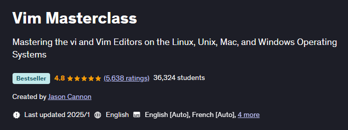

# 《Vim Masterclass》Learning Notes

## 1. Profiles

|    **Title**    |    **Vim Masterclass**    |
| :-------------: | :-----------------------: |
|   **Author**    |     **Jason Cannon**      |
| **Publication** | **Last updated: 2024.02** |
|    **Parts**    |          **50**           |

> **Introduction** 
> **简介**
>
> Did you know that the most productive command line experts exploit the powerful features of the Vim text editor? 
> 您是否知道最高效的命令行专家会榨干 Vim 的强大功能？
>
> The problem is that if you want to get really good with Vim it can take you an extremely long time if you're trying to learn it on your own. 
> 问题是，如果您想真正熟练地使用 Vim 并尝试自学，可能会花费相当长的时间。
>
> That's why the Vim Masterclass was created. 
> 这就是 Vim 大师班的创办初衷。
>
> This course gives you the absolute shortest path to learning the basics. It also provides you the fastest way to learn the most advanced features, too. 
> 本课程为您提供学习基础知识的绝对最短路径，并提供学习最高级功能的最快方法。
>
> By the time you finish the Vim Masterclass you'll know how to: 
> 当您完成 Vim 大师班课程，您将知道如何：
>
> - **Work with multiple files**, including how to move data back and forth between different files, copying & pasting from one file to another, and quickly jumping to another file.  You'll also learn how to view multiple files at the same time using Vim's windowing system.
>   **处理多个文件**，包括如何在不同文件之间来回移动数据、从一个文件复制并粘贴到另一个文件以及快速跳转到另一个文件。您还将学习如何使用 Vim 的窗口系统同时查看多个文件。
> - **Use the must-know keyboard shortcuts** and how to remember them easily.  You'll actually learn how to "think in Vim" so you don't even have to memorize each and every command, saving you countless hours of work.
>   **使用必须知道的键盘快捷键** 以及如何轻松记住它们。您实际上将学习如何“在 Vim 中思考”，因此您甚至不必记住每一个命令，从而节省您无数的工作时间。
> - **Find and replace entire blocks** of information within a file.  That includes how to refactor your code by renaming all variables in a file or set of files, reliably.  Of course, you'll learn simple find and replace techniques to replace a word in an entire file and much more.
>   **查找并替换文件中的整个信息块**。这包括如何通过可靠地重命名一个文件或一组文件中的所有变量来重构代码。当然，您将学习简单的查找和替换技术来替换整个文件中的单词等等。
> - **Cut, copy and paste**.  You'll find out how to make the most of Vim's built-in clipboard system, use Vim's clipboard history, and how to access your system's clipboard from within Vim.
>   **剪切、复制和粘贴**。您将了解如何充分利用 Vim 的内置剪贴板系统、使用 Vim 的剪贴板历史记录以及如何从 Vim 中访问系统的剪贴板。
> - **Visually select blocks of text** and perform edits on those blocks like moving the block, deleting the block, indenting/shifting the block, and more.  You'll understand Vim's text objects so you can quickly select single or multiple words, lines, paragraphs, HTML/XML tags, code blocks, and more.
>   **直观地选择文本块** 并对这些块执行编辑，例如移动块、删除块、缩进/移动块等。您将了解 Vim 的文本对象，以便快速选择单个或多个单词、行、段落、HTML/XML 标记、代码块等。
> - **How to make vertical edits** and use Vim's Visual Block Mode.  (Some call this column editing mode or rectangle mode…)
>   如何进行垂直编辑** 和使用 Vim 的视觉块模式。 （有人称此列编辑模式或矩形模式......）
> - **Enable syntax highlighting** for source code, configuration files, or any type of file you edit often.  That includes how to customize the color scheme and color code text in Vim.
>   为源代码、配置文件或您经常编辑的任何类型的文件 **启用语法突出显示**。其中包括如何在 Vim 中自定义配色方案和颜色代码文本。
> - **Employ simple to advanced navigation techniques** so you can go exactly to where you need in a file very fast.
>   采用简单到高级的导航技术**，以便您可以快速准确地到达文件中所需的位置。
> - **Practical application tips** such as how to edit source code, scripts, HTML, and more.  You'll find lots of opportunities for practice in this course.
>   **实用的应用技巧**，例如如何编辑源代码、脚本、HTML 等。在本课程中您会发现很多练习的机会。
> - **Make the most of the built-in help system** to quickly find what you need, all without leaving Vim.
>   **充分利用内置帮助系统** 快速找到您需要的内容，而无需离开 Vim。
> - **Use MacVim and gVim** on Linux and Windows.  This includes learning the advantages and disadvantages of both the textual interface and the graphical interfaces to Vim.
>   在 Linux 和 Windows 上 **使用 MacVim 和 gVim**。这包括学习 Vim 文本界面和图形界面的优点和缺点。
> - **Create, save, and replay macros** to normalize data and quickly repeat complicated edits.  You'll learn how to append or prepend text to every line in a text file, how to format one line of text and apply that formatting to a specified area in the file and more.  In short, you'll learn how to automate everything in Vim.
>   **创建、保存和重播宏**以标准化数据并快速重复复杂的编辑。您将了解如何将文本追加或添加到文本文件中的每一行，如何设置一行文本的格式并将该格式应用于文件中的指定区域等等。简而言之，您将学习如何自动化 Vim 中的一切。
> - **Create custom shortcuts and personalized key mappings**.  If you want to create a shortcut for something you do often, you'll find out how to make your life a whole lot easier.
>   **创建自定义快捷键和个性化按键映射**。如果您想为经常做的事情创建快捷方式，您会发现如何让您的生活变得更加轻松。
> - **Indent and shift blocks of text**.  You'll also learn how to enable auto indentation so you can quickly clean up and prettify your source code. 
>   **缩进和移动文本块**。您还将了解如何启用自动缩进，以便快速清理和美化源代码。
> - And more...  
>   等等...
>
> When you start the course, you'll be able to use vim almost immediately.  I want to make sure you get up and running as quickly as possible.  That's why at the beginning of the course you'll learn how to start vim, how to make simple edits, and how to save your changes. 
> 当您开始本课程时，您几乎立即就能使用 vim。我想确保您尽快启动并运行。这就是为什么在课程开始时您将学习如何启动 vim、如何进行简单的编辑以及如何保存更改。
>
> After that, we'll build on your knowledge and even get into some really advanced techniques such as editing multiple files at once, creating macros, making global substitutions in many files at the same time, ways to format and normalize data, how to "think in vim", and much more. 
> 之后，我们将基于您的知识，甚至学习一些非常先进的技术，例如一次编辑多个文件、创建宏、同时在许多文件中进行全局替换、格式化和规范化数据的方法、如何“在 vim 中思考”等等。
>
> Having taught thousands of students over the years, I know people learn best by doing. That's why I've packed this course with tons of practice exercises.  For each exercise you, get detailed, step-by-step instructions.  I encourage you to try the labs on your own first.  Then I walk through the exercise while you look over my shoulder. 
> 多年来，我教过成千上万的学生，我知道人们通过实践学得最好。这就是为什么我在这门课程中加入了大量的练习。对于您的每个练习，都会获得详细的分步说明。我鼓励您首先尝试自己的实验室。然后我会完成练习，而你则在我身后看着。
>
> Not only will you learn the concepts, you'll watch me demonstrate how to put those concepts to good use, and you'll practice those new skills immediately so that you really understand and retain what you're learning. 
> 您不仅会学习这些概念，还会观看我演示如何充分利用这些概念，并且您将立即练习这些新技能，以便真正理解并保留所学内容。
>
> This course is ideal for anyone who works on the command line often.  Whether you're a system administrator, a developer, a database administrator, or anyone else who has to edit files in a command line environment, this course is for you. 
> 本课程对于经常使用命令行工作的任何人来说都是理想的选择。无论您是系统管理员、开发人员、数据库管理员，还是任何需要在命令行环境中编辑文件的人，本课程都适合您。
>
> Even though this course does cover the graphical version of vim, it is NOT for people who are looking for "what you see is what you get" (WYSIWYG) word processing help. 
> 尽管本课程确实涵盖了 vim 的图形版本，但它不适合那些正在寻找“所见即所得”(WYSIWYG) 文字处理帮助的人。
>
> No, this course is for people who want to get really efficient at editing plain text files, such as server configuration files, shell scripts, source code, and any other type of textual data. 
> 不，本课程适合那些想要真正高效地编辑纯文本文件（例如服务器配置文件、shell 脚本、源代码和任何其他类型的文本数据）的人。
>
> So, if you're tired of being scared of vim, or just aren't making the progress you'd hope to by just dabbling in vim, it's time to take your vim skills to the next level by enrolling in this course. 
> 因此，如果您厌倦了害怕 vim，或者仅仅涉足 vim 并没有取得您希望的进步，那么是时候参加本课程，将您的 vim 技能提升到一个新的水平。

## 2. Outlines

Status available：:heavy_check_mark: (Completed) | :hourglass_flowing_sand: (Working) | :no_entry: (Not Started) | :orange_book: (Finish Learning)

| No.  |          Status          |                 Chapter Title                  |
| :--: | :----------------------: | :--------------------------------------------: |
| S01  |    :heavy_check_mark:    |              Course Introduction               |
| S02  |    :heavy_check_mark:    |                 Vim Quickstart                 |
| S03  |    :heavy_check_mark:    |                 Vim Essentials                 |
| S04  |    :heavy_check_mark:    |              The Vim Help System               |
| S05  |    :heavy_check_mark:    |         Deleting, Yanking, and Putting         |
| S06  |    :heavy_check_mark:    |       Transforming and Substituting Text       |
| S07  |    :heavy_check_mark:    |            Text Objects and Macros             |
| S08  | :hourglass_flowing_sand: |                  Visual Mode                   |
| S09  |      :orange_book:       | Vim Settings, Preferences, and Customizations  |
| S10  |      :orange_book:       |            Vim Buffers and Windows             |
| S11  |      :orange_book:       |                  Vim Plugins                   |
| S12  |      :orange_book:       | Vim Graphical User Interfaces: Gvim and MacVim |
| S13  |      :orange_book:       |                 Live Q&A Calls                 |

