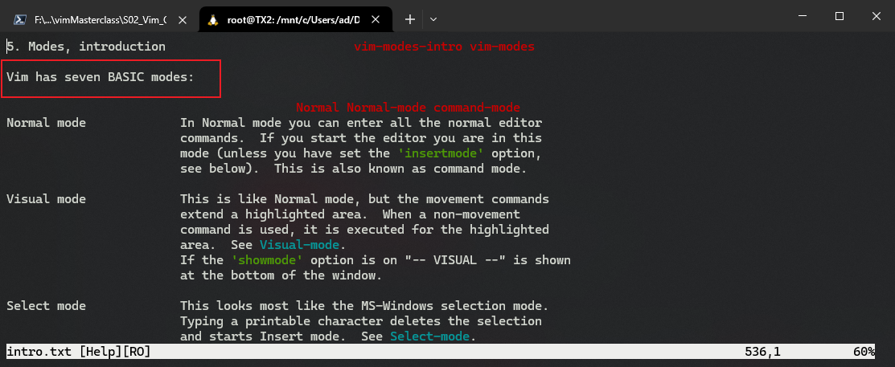

# L04 Modes
---

Vim 三大模式：

- `Normal / Command mode`：正常模式（命令模式）
- `Insert mode`：插入模式
- `Command-line / cmdline / line mode`：命令行模式（单行模式）

> [!tip]
>
> 实测时，通过查看内置帮助文档（使用 `:help intro`）得知，Ubuntu 上的 `Vim` 版本为 `8.1.2269`。此时支持的 `Vim` 基本模式已增至 7 种：
>
> 1. `Normal`
> 2. `Visual`
> 3. `Select`
> 4. `Insert`
> 5. `Command-line / Cmdline`
> 6. `Ex`
> 7. `Terminal-Job`
>
> 
