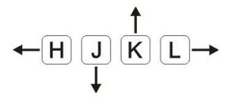
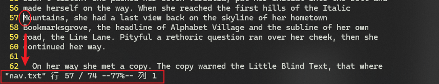
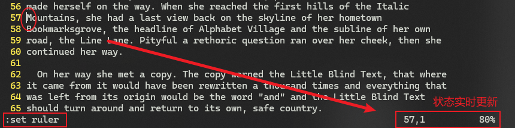

# L08 Essential Navigation Commands
---

本节练习 `Vim` 浏览内容的基本操作。

## 1 光标的上下左右移动

**图 8.1 Vim 控制光标上下左右的键盘操作**

即便键盘上的四个方向键失灵，`H`、`J`、`K`、`L` 依然有效。应当熟悉 Vim 控制方向的方式，双手不离主键盘。

记忆法：H 在最左边，L 最右，J 似鱼钩，剩下 K 则向上

abcd

## 2 上 / 下翻页

上一页：<kbd>Ctrl</kbd> + <kbd>F</kbd>（**F**orward）

下一页：<kbd>Ctrl</kbd> + <kbd>B</kbd>（**B**ackward）

## 3 基于单词前移

`Vim` 支持的文本对象（text object）：单词（words）、句子（sentences）、段落（paragraphs）、块（blocks）……

按单词前移：

- <kbd>w</kbd>：按单词逐个前移，标点也算一个独立的单词；
- <kbd>W</kbd>：按单词逐个前移，标点不算独立的单词，予以忽略。改用 **空白** 作单词分隔符；

`Vim` 中的单词：即一个 **非空的字符序列**

## 4 基于单词后移

类比前移：

- <kbd>b</kbd>：按单词逐个后移，标点也算一个独立的单词；此时空白、标点都算分隔符；
- <kbd>B</kbd>：按单词逐个后移，标点不算独立的单词，予以忽略。改用 **空白** 作单词分隔符；

## 5 重新定位视图中的文本（页面重绘）

页面重绘：<kbd>z</kbd> + <kbd>Enter</kbd>

作用：将光标所在行调整至页面偏上的位置（具体偏上多少可以手动配置）。

## 6 定位到所在行的行首

- <kbd>0</kbd>：此时 **缩进也算内容**，光标移动到当前行第 1 列；
- <kbd>^</kbd>：此时 **缩进不算内容**，光标移动到当前行第 1 个非空字符；（类似正则表达式）

## 7 光标定位到某行

- <kbd>gg</kbd>：前跟行号则到指定行；单独使用则定位到 **第一行**；
- <kbd>G</kbd>：前跟行号则到指定行；单独使用则定位到 **最后一行**；
- <kbd>:</kbd><kbd>LineNumber</kbd><kbd>Enter</kbd>：命令行模式下，冒号+目标行号，回车即定位到指定行

例如：

- 定位到 **末尾行**：<kbd>G</kbd> 或 <kbd>:</kbd><kbd>$</kbd><kbd>Enter</kbd>（联想正则表达式）
- 定位到 **首行**：<kbd>gg</kbd> 或 <kbd>1</kbd><kbd>gg</kbd> 或 <kbd>:</kbd><kbd>1</kbd><kbd>Enter</kbd> 甚至是  <kbd>0</kbd><kbd>gg</kbd>、<kbd>:</kbd><kbd>0</kbd><kbd>Enter</kbd>（类比 `:$<Enter>`，唯独不能用 `:^<Enter>`）（其实可能也表示 `0` 无效）

## 8 查看当前行统计信息

组合键：<kbd>Ctrl</kbd> + <kbd>G</kbd>

**图 8.2 组合键【Ctrl + g】用法示例**

缺点：不能实时刷新结果，需手动重算。

改进：命令模式下启用 `ruler`：`:set ruler` + <kbd>Enter</kbd> 

实测效果：（支持状态信息实时更新）

**图 8.3 命令模式下启用 ruler 展示状态信息**

此时再用 <kbd>Ctrl</kbd> + <kbd>G</kbd>，则显示：

**图 8.4 启用 ruler 后的状态栏效果验证**

禁用 `ruler`：<kbd>:set noruler</kbd><kbd>Enter</kbd>

> [!tip]
>
> `Vim` 命令模式中的配置项，激活与禁用都有固定格式——
>
> - 启用：`:set [option_name]`
> - 禁用：`:set no[option_name]`
> - 切换：`:set [option_name]!`（开/关，取反操作，逻辑非）
> - 查询当前状态：`:set [option_name]?`
