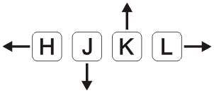

# L09 Exercise 02 Essential Navigation Commands
---


## 1 目标

练习光标在文件内的各种移动定位操作 [^1]。


## 2 具体操作

### 1. 打开 nav.txt 文件

打开本地命令行，用 vim 打开 `nav.txt` 文件：

```bash
cd Downloads
cd vimclass
vim nav.txt
```


### 2. 练习光标逐行或逐个字符移动



按 <kbd>J</kbd> 键[^2] 10 次来让光标下移 10 行。此时光标位于下面这行：

```markdown
You can also press and hold a navigation key so that it repeats.
```

按 <kbd>K</kbd> 键 4 次上移 4 行，光标则移至下面这行的起始位置：

```markdown
To move to the right, press "l".
```

按 <kbd>L</kbd> 键 8 次移动到单词 “to.” 上、

再按 <kbd>J</kbd> 键 2 次移动到如下这行：

```markdown
To move to the left, press "h".
```

注意观察光标是怎么保持在同一列上的（即光标相对该行左端的距离与之前一致）。

然后连续按 <kbd>H</kbd> 键，将光标移动到行首。

最后，按住 <kbd>K</kbd> 键，将光标移动到文件的起始位置。


### 3 按页移动光标练习

按 <kbd>Ctrl</kbd> + <kbd>F</kbd> 下翻一页。

按 <kbd>Ctrl</kbd> + <kbd>B</kbd> 上翻一页。

按住 <kbd>Ctrl</kbd>，并不断按下 <kbd>F</kbd> 键抵达文件的末尾位置。页面下翻的次数会根据当前屏幕尺寸的不同而有所浮动。切记：文件中的波浪符 `~` 表示**该行已超出该文件末尾**（the tildes represents lines beyond the end of the file）。

最终效果大致如下（具体也要视当前屏幕尺寸而定）。注意那些波浪符号：

****

```bash
This training is being provided by LinuxTrainingAcademy.com.
~
~
~
~
~
~
~
~
```

向上翻页则通过按住 <kbd>Ctrl</kbd> 键并按下 <kbd>B</kbd> 实现。


### 4 按单词移动光标练习

将光标移至下面这行。一个简单的做法是按住 <kbd>K</kbd> 键不放，直到光标抵达该行；要是走过了，再按 <kbd>J</kbd> 键回到这行：

```
  Far far away, behind the wild mountains, far from the countries Vokalia and
```

按小写的 <kbd>W</kbd> 键 4 次。光标移至该行的第一个逗号（`,`）位置；再按 <kbd>W</kbd> 5 次，则移至该行第二个逗号（`,`）位置。

按小写的 <kbd>B</kbd> 键 8 次，回到本句第一个单词（`Far`）。注意，此时逗号也被视为一个单词。

再按大写的 <kbd>W</kbd> 键 3 次，向前移至单词 “behind” 处。注意，其间光标不会在逗号处停留；再按大写的 <kbd>W</kbd> 键 4 次，则前移至单词 “far” 处。

想要返回本行中的第一个单词，需要反复按大写的 <kbd>B</kbd> 键 7 次。


### 5 练习将光标移动到指定的行上

键入 <kbd>G</kbd><kbd>G</kbd> 移至文件首行。

按下大写的 <kbd>G</kbd> 键移至文件最后一行。

再键入 <kbd>1</kbd><kbd>GG</kbd> 回到文件首行。注意该操作是否与 <kbd>GG</kbd> 保持一致。然后键入 <kbd>29</kbd><kbd>GG</kbd> 移至第 29 行。

也可以用大写的 <kbd>G</kbd> 键定位到具体某行，如按下 <kbd>3</kbd><kbd>Shift</kbd><kbd>G</kbd>。

接着再用命令行模式移至第 44 行。键入 <kbd>:</kbd><kbd>44</kbd><kbd>Enter</kbd>。然后键入 <kbd>:</kbd><kbd>$</kbd><kbd>Enter</kbd> 移至最后一行。

要确认光标已在最后一行，键入 <kbd>Ctrl</kbd><kbd>G</kbd> 来显示当前文件的相关信息（状态栏应该可以看到 100% 字样）


### 6 自主练习

如果您愿意的话，可以用本节所学知识在文件中任意导航，体会其中的乐趣。


### 7 退出 vim

完成本节文件内容导航练习后，按 <kbd>:q!</kbd><kbd>Enter</kbd> 键退出。


---

[^1]: 本节练习另附精美排版 PDF 格式，阅读体验更佳，详见：`vimclass/Exercise-02-EssentialNavigationCommands.pdf`

[^2]: 默认情况下，所有单个字母的按键格式均为该字母的小写形式；若为大写，会单独添加 <kbd>Shift</kbd> 键来区分。