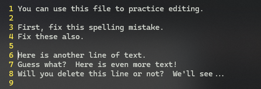

# L11 Deleting Text and "Thinking in Vim"
---


## 1 删除单个字符

删除当前光标所在的单个字符：<kbd>X</kbd>

删除当前光标所在字符的前一个字符：<kbd>Shift</kbd> + <kbd>X</kbd>


## 2 删除一个单词

<kbd>DW</kbd>：删除一个单词 [^1]

Vim 基本形式：**operation{motion}**（ **操作{移动}** ）——

- 这里的 **操作** 即 <kbd>D</kbd>，表示 “**删除操作**”；
- **移动** 即 <kbd>W</kbd>，这里表示 **一个单词的位移量**。


### 2.1  推广1：<kbd>D</kbd> + <kbd>H</kbd><kbd>J</kbd><kbd>K</kbd><kbd>L</kbd>

此外，由于浏览内容用的 <kbd>H</kbd>、<kbd>J</kbd>、<kbd>K</kbd>、<kbd>L</kbd> 命令也是一个 **motion**，因此，<kbd>DW</kbd> 还可以写成 <kbd>D</kbd> + n × <kbd>L</kbd>，即若干个 <kbd>L</kbd> 键，直到该单词被删除。

再联系 <kbd>X</kbd> 的用法：

- 小写 <kbd>X</kbd> 相当于 <kbd>DL</kbd>，删除光标当前位置的字符；
- 大写 <kbd>X</kbd> 则相当于 <kbd>DH</kbd>，删除紧挨光标前的那个字符。

那么，<kbd>DJ</kbd> 和 <kbd>DH</kbd> 呢？由于 <kbd>J</kbd> 的移动量是从上一行到下一行（如下图所示），因此 <kbd>DJ</kbd> 是否只会删除图中选中的部分？


**图 11-1 J 键产生的光标位移效果**

答案是否定的—— <kbd>DJ</kbd> 删除的是光标所在的 **一整行**，外加光标下面的那 **一整行**，如图 11-2 所示：



**图 11-2 按下 dj 后的实际效果：删除了两行，而不是单独的 J 选中的部分**

因此基本形式中的 `motion` 还不能简单理解为 **位移量**，而是要看当时 `motion` 的真实含义：<kbd>J</kbd> 表示将光标从 **当前行向下 *移动* 一行**，因此删除的是两行，而非单个 <kbd>J</kbd> 键扫过的部分。

同理，<kbd>DK</kbd> 的效果即为 **删除当前行以及上一行**。


### 2.2 推广2：<kbd>D</kbd> + <kbd>0</kbd><kbd>$</kbd>

有了上面的铺垫，<kbd>D0</kbd> 和 <kbd>D$</kbd> 的行为就更好理解了，二者分别删除当前光标到该行起始、以及该行结束的内容：

```shell
# 0. Before operation
Here is another line of text.
           ^ current cursor position
# 1. after pressing d0
ther line of text.
^ current cursor position
# 2. after pressing d$ (no content)
Here is ano
          ^ current cursor position
```


### 2.3 推广3：大写的 <kbd>D</kbd>

在 Vim 中，大写的 <kbd>D</kbd> 表示 <kbd>D$</kbd>，即删除当前光标及其后面所有的内容（在同一行上）


可见，Vim 中要达到同一个目的，通常有很多操作方案，根据个人喜好选择即可。自己熟悉的操作才更容易记牢。


## 3 删除一整行

按键：<kbd>D</kbd><kbd>D</kbd>（均为小写）


### 3.1 推广1：删除  3 行

按键：<kbd>3</kbd><kbd>D</kbd><kbd>D</kbd>

由此出现了 Vim 的另一个基本形式：**[count]operation{motion}**（**[数量]操作{移动}**）——

<kbd>5</kbd><kbd>D</kbd><kbd>W</kbd>：

- <kbd>5</kbd>：重复操作的次数
- <kbd>D</kbd><kbd>W</kbd>：待重复命令（删除单个单词）

其实 <kbd>D</kbd><kbd>W</kbd> 只是 <kbd>1</kbd><kbd>D</kbd><kbd>W</kbd> 省略了重复次数 <kbd>1</kbd> 之后的特殊形式。


### 3.2 推广2：[count]operation[count]{motion}

回忆 L08 中介绍的核心浏览操作，**{motion}** 前还可以跟一个数量：**[count]{motion}**，因此结合第二个 Vim 基本形式，得到第三种推广形式：**[count]operation[count]{motion}**

注：这里的中括号 `[]` 表示非必填项，`{}` 则为必填项，什么都不加的也是必填项。

再看一个例子加深印象：

- <kbd>3</kbd><kbd>W</kbd>：重复 <kbd>W</kbd> 移动 3 次。
- <kbd>D</kbd><kbd>3</kbd><kbd>W</kbd>：删除 <kbd>3W</kbd> 移动（一遍）。即删除 3 个单词。
- <kbd>2</kbd><kbd>D</kbd><kbd>3</kbd><kbd>W</kbd>：删除 <kbd>3W</kbd> 移动，共执行两遍。即删除 6 个单词。


## 4 点操作符 <kbd>.</kbd>

表示快速重复上一次操作。类似 MS Word 中的 <kbd>Ctrl</kbd> + <kbd>Y</kbd>。


## 5 保存文件相关操作

### 5.1 编辑过程中报错文件

操作：`:w` + <kbd>Enter</kbd>

执行完毕后仍在 Vim 常规模式下。


**图 11-3 在不退出 Vim 的情况下保存文件的操作**


### 5.2 保存并退出文件

操作：`:wq` + <kbd>Enter</kbd>


### 5.3 退出文件且不保存变更

操作：`:q!` + <kbd>Enter</kbd>


## 6 感叹号键 <kbd>!</kbd> 的用法

### 6.1 用法1：强制执行

例如，退出但不保存：`:q` + <kbd>!</kbd> + <kbd>Enter</kbd>

此时文件有变更，只是不保存、直接退出。

如果此时省略叹号，变成 `:q` + <kbd>Enter</kbd>，则 Vim 会再次确认是否真的想退出，并给出提示信息（如图所示）：


**图 11-4 有变更但未强制退出时，Vim 会中断操作并给出中文提示信息**


**图 11-5 有变更但未强制退出时，Vim 会中断操作并给出英文提示信息**

上面两张截图，第一张是 Windows 下安装的 v9.1 版 Vim；第二张为 Windows Subsystem for Linux（WSL）下 Ubuntu 系统自带的 v8.1 版 Vim。二者效果一致，都会中断操作。


### 6.2 用法2：切换状态

如配置状态栏的信息显示与否时，可以使用 `:set ruler` + <kbd>!</kbd> 来切换 `:set ruler` 和 `:set noruler` 两个状态。


### 6.3 用法3：执行某个命令行命令

（后面详述，本节略）


---

[^1]: 准确讲，应该是从 **当前光标位置** 开始，将按下小写 <kbd>W</kbd> 键经过的内容都删掉。

