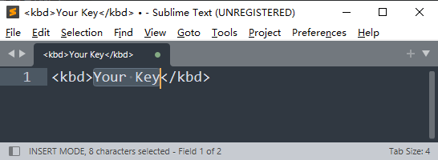

# 【工欲善其事】巧用 Sublime Text 生成带格式的 HTML 片段

---

## 1 问题由来


**【图 1 Markdown 文档编辑神器 Typora】**

用惯了 Typora 这类专门写 Markdown 文章的软件后，偶尔遇到一些不方便处理的 HTML 标记就显得很不流畅。比如给某个按键添加 `<kbd></kbd>` 标签，Typora 里就没有对应的快捷键。通常我都是用行内的代码块来替代（快捷键：<kbd>Ctrl</kbd> + <kbd>Shift</kbd> + <kbd>\`</kbd>），比如按下 Ctrl 键，就表示成 `Ctrl`，而不是通过手动添加 `<kbd>` 标签变成 <kbd>Ctrl</kbd>。

但最近刚好就碰到需要大量输入这样的按键格式的场景。因为我想把 Vim 的操作技巧再整理整理，以前落下的笔记顺便完善完善。结果里面就有大量按键组合需要输入。如果都做成代码块的格式倒也不是不行，可转念一想，自己天天写博客都在提醒大家注意文档的语义化，写的时候虽然麻烦些，但后面这类高质量内容就可以很方便地用于其他场合，比如屏幕阅读工具、NLP 语料库的数据训练等等，所以还是写成 `<kbd>` 标签更合适。

那么，有没有什么方法可以加速这个格式化过程呢？

我想到了 Sublime Text 提供的自定义代码片段（Snippets）功能。


## 2 操作流程

根据 Sublime Text 的官方文档，定制代码片段成功后，只需要在某个语法环境里（比如默认的纯文本环境，即 `plain text`）输入一串快捷字符（如小写英文字母 `k`），然后按下 <kbd>Tab</kbd> 键，编辑器就能快速生成 `<kbd></kbd>`，并且光标还能自动定位到标签之间。这样，只需输入我想要文本内容，再全选、剪切、粘贴——就大功告成了！

具体步骤如下：

### 步骤1：打开代码片段定制页

位置：`Tools | Developer | New Snippet...`


**【图 2 打开代码片段定制页】**


### 步骤2：在新标签页输入定制 XML

内容如下：

```xml
<snippet>
	<content><![CDATA[<kbd>${1:Your Key}</kbd>]]></content>
	<!-- Optional: Set a tabTrigger to define how to trigger the snippet -->
	<tabTrigger>k</tabTrigger>
	<!-- Optional: Set a scope to limit where the snippet will trigger -->
	<scope>text.plain</scope>
    <description>自动生成按键元素 &lt;kbd>&lt;/kbd>，并让光标定位到开闭标签之间</description>
</snippet>
```

除了默认打开时的纯文本环境（`text.plain`），常见的语法环境对应的 `<scope>` 节点的取值如下：

|   语法环境   |     scope 值      |
| :----------: | :---------------: |
| `JavaScript` |    `source.js`    |
|    `HTML`    |   `source.html`   |
|    `CSS`     |   `source.css`    |
|    `Java`    |   `source.java`   |
|     `C`      |    `source.c`     |
|    `C++`     |   `source.cpp`    |
|    `PHP`     |   `source.php`    |
|    `Ruby`    |   `source.ruby`   |
|     `Go`     |    `source.go`    |
| `Shell` 脚本 |  `source.shell`   |
| `基础 HTML`  | `text.html.basic` |
|    `JSON`    |   `source.json`   |
|    `XML`     |    `text.xml`     |


### 步骤3：保存定义内容

**步骤2** 中定义的内容会以文件形式默认保存到 Sublime Text 数据目录下的 User 包（Package）里面，格式为：`<CUSTOM_SNIPPET_NAME>.sublime-snippet`，比如我这个片段，就命名为：`keyboard_tag_pair.sublime-snippet`：


**【图 3 保存定义内容】**

如果没有自动定位到这里也无妨，用这段 PowerShell 脚本查看即可：

```shell
echo $env:APPDATA
```

再不行，就用最原始的方式：在 Sublime Text 图标上右键，选择打开文件所在的位置：


**【图 4 从应用图标反向查找 Sublime Text 安装路径】**

再次强调，新增的这个片段文件，它的扩展名一定得是 `*.sublime-snippet` 形式，否则编辑器无法正确识别！！！

一定得是 `*.sublime-snippet` 形式！！！
一定得是 `*.sublime-snippet` 形式！！！
一定得是 `*.sublime-snippet` 形式！！！

重要的事情说三遍。


### 步骤4：功能测试

由于该片段在纯文本环境生效（定义作用域时写的 `<scope>text.plain</scope>`），因此只需打开一个空白标签，输入小写英文字母 `k`，然后按下 <kbd>Tab</kbd> 键，应该就会看到下面的效果：



**【图 5 自动生成的 HTML 代码片段测试效果】**

然后输入 `Ctrl`，就变成了：


**【图 6 直接输入中间的文字内容】**

这时再全选、剪切（或复制），就可以粘贴到 Typora 生成按键效果的字符内容了！


## 3 拓展

既然可以自定义 `<kbd></kbd>` 这样的 HTML 标记内容，发表博文时自定义的一些 HTML 片段也可以用它来生成。

如果需要多个占位符（如上面的 `Your Key` 提示信息），可以使用 `${2:placeholder2}`、`${3:placeholder3}` 这样的格式指定占位符出现的具体位置；调用时通过 <kbd>Tab</kbd> 键能可以实现按指定的序号依次选中每个需要手动输入的地方。最后再全选复制出来，就都搞定了。

要是定义片段的时间过于久远，或者不知道当前这台电脑定义了那些可用的片段，可以通过这行 PowerShell 脚本查看：

```shell
ls $env:APPDATA/"Sublime Text"/packages/User/*.sublime-snippet
```

这里的 `$env:APPDATA/"Sublime Text"` 就是当前电脑 Sublime Text 的安装路径。

最后的最后，再介绍一个快速浏览自定义代码片段的操作：使用快捷键 <kbd>Ctrl</kbd> + <kbd>Shift</kbd> + <kbd>P</kbd> 弹出命令条，输入 `snippet:` 就能看到已经定义好的代码片段：


**【图 7 通过快捷命令栏快速浏览可用的自定义代码片段】**

更多配置详情，可以参考 Sublime Text 的官方文档：[https://www.sublimetext.com/docs/completions.html#snippets](https://www.sublimetext.com/docs/completions.html#snippets)。