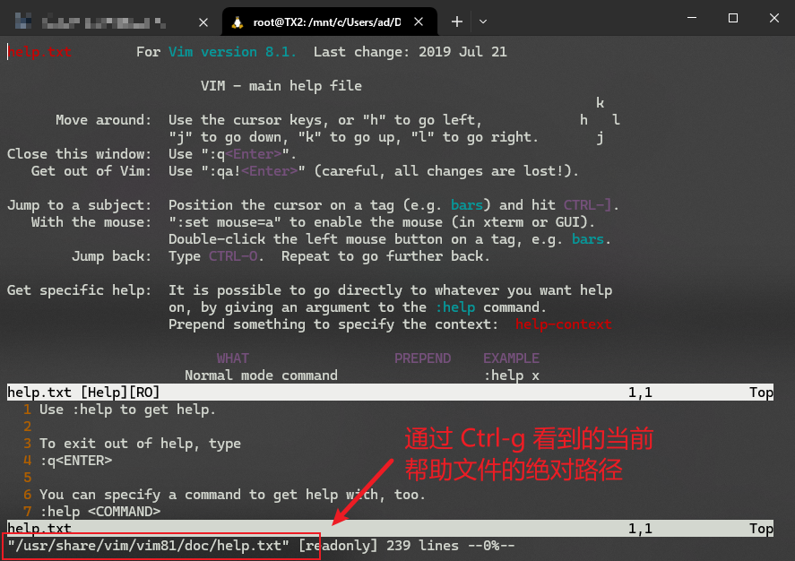
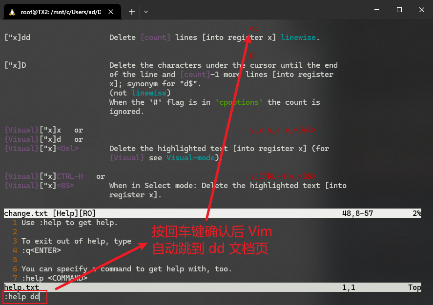
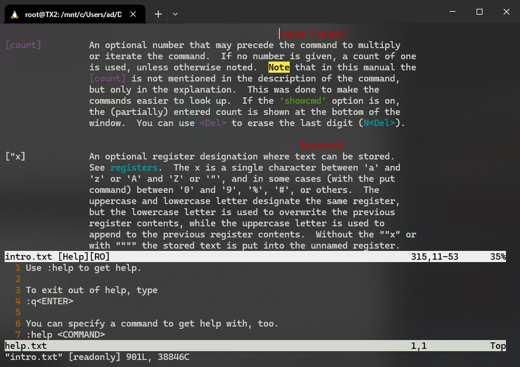
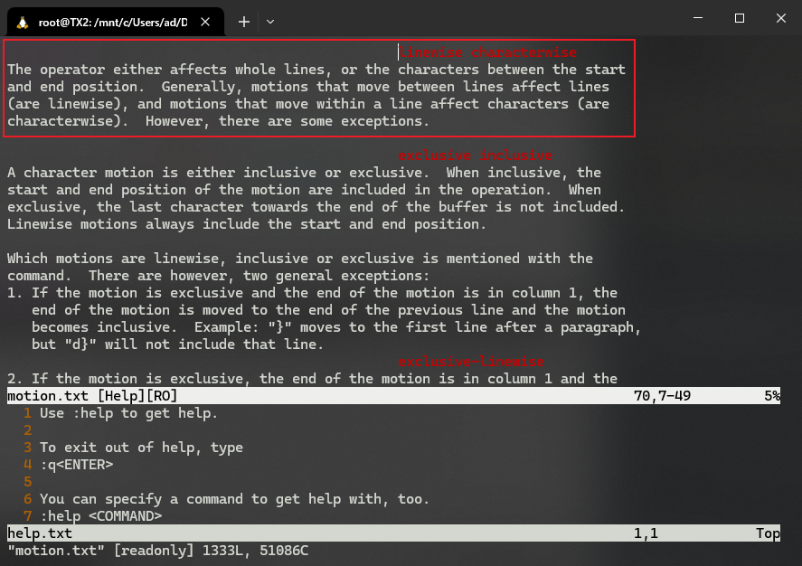
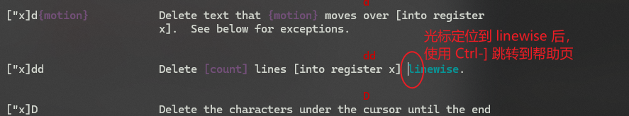
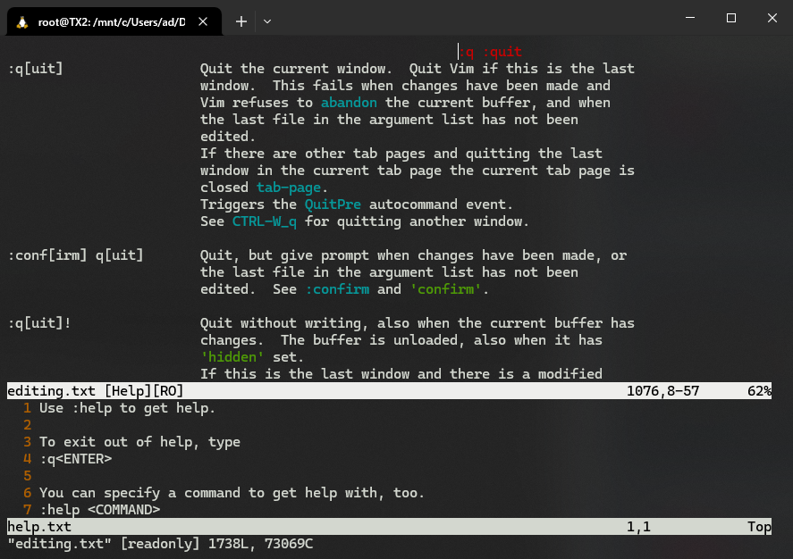
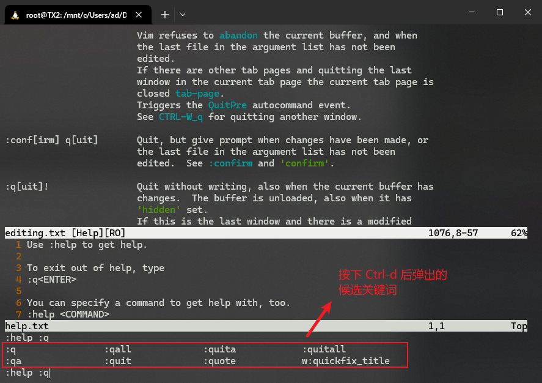
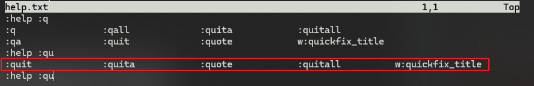
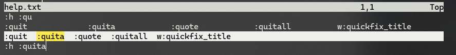

# L14 Getting Help
---

本节介绍 Vim 的帮助系统的用法（演示文件：`help.txt`）。

## 1 打开帮助系统

命令模式下：`:help` + <kbd>Enter</kbd>

Vim 帮助系统也是一个文本窗口，之前介绍的 <kbd>H</kbd><kbd>J</kbd><kbd>K</kbd><kbd>L</kbd> 等命令均有效。

使用 <kbd>Ctrl</kbd> + <kbd>G</kbd> 可以查看当前帮助文件所在的绝对路径：

## 2 退出帮助系统

命令模式下：`:q` + <kbd>Enter</kbd>（与普通文件的退出一样）

## 3 查看具体命令的帮助文档

例如命令 `dd`，命令模式下输入：`:help dd` + <kbd>Enter</kbd> 即可：

文档说：`Delete [count] lines [into register x] linewise.`

方括号内，是选填项，可以暂时忽略，于是变为：`Delete lines linewise.` 即按行删除（一整行）内容。

`register` 和 `linewise` 这里不展开，后续会介绍。

## 4 查看帮助文档中的主题

除了用 `:help <command>` 查看具体的命令，还可以在打开的帮助页查看不同的主题，例如上面的 `count`：

## 5 帮助文档间的上翻、下翻

返回上一个帮助页：按 <kbd>Ctrl</kbd> + <kbd>O</kbd>（即 `Old`，旧的主题）

返回下一个帮助页：按 <kbd>Ctrl</kbd> + <kbd>I</kbd>

<kbd>O</kbd> 和 <kbd>I</kbd> 在键位上是挨着的，方便识记。

## 6 关于 linewise

使用 `:help linewise` 查看帮助页：

可见 `linewise` 表示以行为单位进行操作，与之对应的是 `characterwise`，即以字符为单位进行操作。

## 7 查看光标所在术语名词的帮助文档

使用：<kbd>Ctrl</kbd> + <kbd>]</kbd>（右方括号）

视频中光标停留的术语名词也叫“主题”（subject）。

## 8 关于退出命令的帮助

键入：`:help :q` + <kbd>Enter</kbd>

注意，这里必须是 `:q`，因为 `q` 是另一个命令，`:q` 才表示退出。

可见，`:q` 的全称为 `:quit`，类似的还有 `:help`，可缩写为 `:h`。

## 9 帮助窗口与工作窗口的切换

使用组合键：<kbd>Ctrl</kbd> + <kbd>WW</kbd>（即按两次 `Ctrl-w`）

## 10 查看命令帮助页前的自动提示（补全）

使用组合键：<kbd>Ctrl</kbd> + <kbd>D</kbd>

例如，输入 `:help :q` 后，按下 <kbd>Ctrl</kbd> + <kbd>D</kbd>，将出现下列以 `:q` 开头的候选命令列表：

此时可以用 <kbd>Tab</kbd> 或 <kbd>Shift</kbd> + <kbd>Tab</kbd> 遍历弹出的候选命令。

若再输入 `:qu` 并按 <kbd>Ctrl</kbd> + <kbd>D</kbd>，Vim 将 **重新列出** 以 `:qu` 开头的候选命令列表：

视频中的当前候选命令呈高亮显示，是因为配置了一个叫 `wildmenu` 的选项，实测时本地并未启用，可通过 `:set wildmenu` 打开，于是候选命令也有了高亮显示：

但该配置关闭电脑后又会还原。关于 Vim 配置如何永久生效，后续会详述，这里略过。
