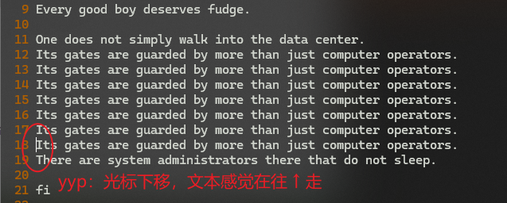
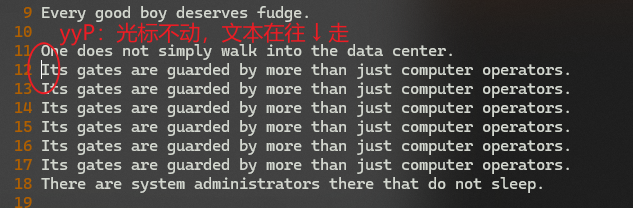

# L17 Cut, Copy and Paste - Part I
---

本节介绍 `Vim` 的文本剪切、复制与粘贴操作。

演示文件：`vimclass/cutcopypaste.txt`

## 0 为什么会用到剪切、复制、粘贴

- 移动文件文本的需要；
- 重复（Duplicate）文本内容的需要；
- 创建一个文件内部的简要备份（如配置文件中 [^1]）
- 复用（Reuse）同一段文本的需要；

其实剪切相关的命令已经学过一些了：

- `d` 命令与 `x` 命令其实是 **剪切** 命令，不仅仅是删除；
- **剪切** = **删除** + 存入 **寄存器**（`register`）
- 寄存器是一个类似剪切板（clipboard）的存储区域

## 1 默认寄存器（未命名寄存器）default register / unnamed register

按 <kbd>D</kbd><kbd>D</kbd> 剪切第 1 行，该行内容将存入 **默认寄存器（default register）**（也叫**未命名寄存器（unnamed register）**）。

<kbd>P</kbd>：在当前光标的下一行，粘贴刚才剪切的内容。

在 `Vim` 中，`p` 命令又叫 `put` 命令。也可以理解为 paste（粘贴）

## 2 交换两行文本

使用 <kbd>D</kbd><kbd>D</kbd><kbd>P</kbd>：先剪切第一行（第二行上移）再粘贴到原第二行的下一行。

## 3 粘贴到当前光标的上一行

使用 <kbd>Shift</kbd> + <kbd>P</kbd>

注意：剪切（cut）后的内容可以被多次粘贴（`put`），只要寄存器中的内容未被其他命令（如删除命令 `d`）清除。

## 4 粘贴某个字符

先用 <kbd>X</kbd> 剪切，再用 <kbd>P</kbd> 粘贴该字符。

<kbd>X</kbd><kbd>P</kbd>：交换当前光标与光标 **右边** 的一个字符（还原：<kbd>Shift</kbd><kbd>X</kbd><kbd>Shift</kbd><kbd>P</kbd> + <kbd>X</kbd><kbd>P</kbd>，或者 <kbd>U</kbd><kbd>U</kbd>）

<kbd>Shift</kbd><kbd>X</kbd> + <kbd>P</kbd>：交换当前光标与光标 **左边** 的一个字符（还原：<kbd>Shift</kbd><kbd>X</kbd><kbd>Shift</kbd><kbd>P</kbd> + <kbd>X</kbd><kbd>P</kbd>，或者 <kbd>U</kbd><kbd>U</kbd>）

## 5 剪切光标右边的剩余文字，粘贴到该行开头

<kbd>D</kbd><kbd>$</kbd> + <kbd>0</kbd> + <kbd>Shift</kbd><kbd>P</kbd>

或者：

<kbd>Shift</kbd><kbd>D</kbd> + <kbd>0</kbd> + <kbd>Shift</kbd><kbd>P</kbd>

## 6 复制内容

使用 <kbd>Y</kbd>：即 `Yank` 命令，表示复制（相当于 Copy）

| 标准叫法 | Vim 叫法 |
| :------: | :------: |
|  `cut`   | `delete` |
|  `copy`  |  `yank`  |
| `paste`  |  `put`   |

## 7 复制 + `operator[motion]`

<kbd>Y</kbd><kbd>W</kbd>：复制一个单词

<kbd>2</kbd><kbd>Y</kbd><kbd>W</kbd>：复制两个单词（或 <kbd>Y</kbd><kbd>2</kbd><kbd>W</kbd>）

粘贴则用 <kbd>P</kbd> 或 <kbd>Shift</kbd> + <kbd>P</kbd>

## 8 复制一整行

使用 <kbd>Y</kbd><kbd>Y</kbd>

## 9 快速复制当前行并粘贴到下一行

使用 <kbd>Y</kbd><kbd>Y</kbd><kbd>P</kbd>

:star: 粘到上一行：<kbd>Y</kbd><kbd>Y</kbd><kbd>Shift</kbd><kbd>P</kbd>

两者的区别：

- `yyp`：光标在原来位置的下一行，感觉被复制的文本在往上 :arrow_up: 走；
- `yyP`：光标还在原来的行上，感觉被复制的文本在往下 :arrow_down: 走。

实测命令 `yyp`：

实测命令 `yyP`：

## 10 复制多行文本

格式：`[count]yy`

<kbd>4</kbd><kbd>Y</kbd><kbd>Y</kbd>：从光标当前行开始（含当前行），下数 4 行内容进行复制。

## 11 撤回操作命令

使用 <kbd>U</kbd>（表示 **U**ndo）

注意：撤回的是上一次 **命令**，而不是某一行（有人误以为误删多行后，按 <kbd>U</kbd> 只恢复一行内容，这是错误的）

## 12 重新执行（重做）命令

使用 <kbd>Ctrl</kbd> + <kbd>R</kbd>（表示 **R**edo）

---

[^1]: 类似场景非常多：修改某配置文件的某行前，先复制一份并注释掉，以此作为备份。

