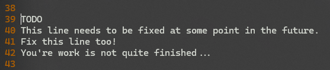
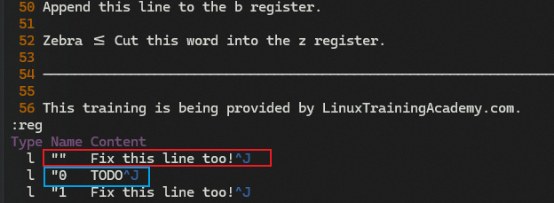
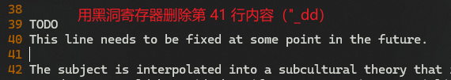
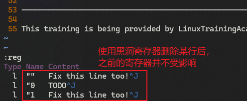
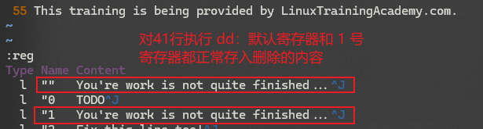

# L18 Cut, Copy and Paste - Part 2 - Registers
---

- 演示文件：`vimclass/cutcopypaste.txt`

## 1 register 的分类

`register`（寄存器）的类型：

- `unnamed`：未命名寄存器，表示为 `""`
- `numbered`：数字寄存器，表示为 `"0`、`"1`、`"2`、……`"9`
- `named`：命名寄存器，表示为 `"a`、`"b`、`"c`、……`"z`

## 2 register 存放的内容

- `""`：holds text from `d`, `c`, `s`, `x` and `y` operations（存储由 `d`/`c`/`s`/`x`/`y` 命令截取下来的文本内容）
- `"0`：holds last text yanked (`y`)（）（存储上一次复制的文本）
- `"1`：holds last text deleted (`d`) or changed (`c`)（存储上一次 `d`/`c` 操作删除的文本）
- Numbered registers shift with each `d` or `c`（数字寄存器在每次 `d`/`c` 操作时 **移位**）

## 3 register 的位移机制（Shift Mechanism）

每次执行 `d` 或 `c` 命令时，现有的寄存器内容会向后移动一位（即 `0` 的内容会移到 `1`、`1` 的内容会移到 `2`，依此类推）。

`0` 号和 `1` 号寄存器总是会分别存储 **最近的** 复制及删除的内容，而 `2` 到 `9` 号寄存器则存储 **之前的** *删除*（*deleted*）或 *改变过*（*changed*）的内容。

> [!warning]
>
> **【注意】**
>
> 复制下来的内容 **并不参与** 位移！
> 复制下来的内容 **并不参与** 位移！
> 复制下来的内容 **并不参与** 位移！
> 复制下来的内容 **并不参与** 位移！
> 复制下来的内容 **并不参与** 位移！
>
> 复制内容只会在 0 号寄存器 **不停被新的复制内容替换**！

## 4 查看 register 列表

使用 <kbd>:</kbd><kbd>R</kbd><kbd>E</kbd><kbd>G</kbd>（即 `:reg`）+ <kbd>Enter</kbd>

## 5 复制于删除内容分开存放的好处

先复制，再删除，此时又想粘贴先前复制的内容，而非删除的内容时，很有效。

## 6 黑洞寄存器（black hole register）

写法：`"_`

作用：不进入寄存器，同时也不影响其他寄存器的正常使用

场景：在需要频繁复制粘贴、且偶尔需要删除一些内容时，对删除内容应用黑洞寄存器。

> **实测：黑洞寄存器和普通寄存器的区别**
>
> 打开 `cutcopypaste.txt` 文件，定位到第 39 行：
>
> 
>
> 复制第 39 行（`TODO`），然后删除第 41 行（`Fix this line too!`），再查看寄存器：
>
> 
>
> 此时文件变为：
>
> 
>
> 使用 **黑洞寄存器** 删除第 41 行：
>
> 
>
> 然后重新打开寄存器列表：
>
> 
>
> 作为对比，再用 <kbd>U</kbd> 撤回删除，改用普通方式删除第 41 行，再次查看寄存器列表：
>
> 
>
> 均符合预期。

## 7 粘贴指定寄存器的内容

`"2p`：在当前行下方，粘贴 2 号寄存器中的内容

## 8 复制 3 行后查看寄存器

运行 `3yy` + `:reg` + <kbd>Enter</kbd>

此时默认寄存器、0 号寄存器均为复制的三行内容（`^J` 代表换行）

## 9 命名寄存器

共 26 个，从 `a` 到 `z`：`"a`、`"b`、`"c`、…… `"z`

复制当前行并存入 `a` 寄存器：`"ayy`

## 10 命名寄存器内容的追加

再复制一行，追加到寄存器 `a`：`"Ayy`

## 11 通过 d 命令存入命名寄存器

`"adw`：将删除的那个单词存入寄存器 `a`

## 12 查看一个或多个具体的寄存器

- 查看 `"z`：`:reg z` + <kbd>Enter</kbd>
- 查看 `"a` 和 `"z`：`:reg az` + <kbd>Enter</kbd>

## 13 寄存器的重复执行

格式：`[count][register]operator`

或者：`[register][count]operator`

例如：`"hyy` + `2"hp` 或者 `"hyy` + `"h2p`（复制到寄存器 `h`，并将内容粘贴两次，粘到当前行的下方）

## 本章小结

- `cut`-`copy`-`paste` = `delete`-`yank`-`put`
- Registers are storage locations（因此又译【缓冲区】，用于存储和读取）
- `""` 包含了上一次操作截取下来的内容（contains last operated on text）
- 没有指定寄存器运行的命令，用的都是默认寄存器里的内容，例如粘贴命令 `p`
- 数字寄存器有 10 个：从 `"0` 到 `"9`。其中：
  - `"0` 存放上一次复制的（yanked）文本
  - `"1` 存放上一次删除的（deleted）文本
- 每成功执行一次删除（delete）或变更（change），寄存器的内容就依次上移一位，直到覆盖 9 号寄存器上次存入的内容。
- 具名寄存器有 26 个：从 `"a` 到 `"z`
- 具名寄存器可使用大写形式对存入的内容进行追加：`"R[yanked][deleted]` 表示将复制或删除的内容追加到寄存器 `"r` 中。
- 查看具体的寄存器：`:reg [register(s)]`
- 操作命令的撤销：<kbd>U</kbd>；重新执行：<kbd>Ctrl</kbd> + <kbd>R</kbd>。撤销与重做都是针对命令而言，而非针对具体内容的行数或字数。
- DIY 补充：`:reg` 列表中的 `Type` 栏表示存放内容的类型。其中：
  - `c` 表示 `characterwise`；
  - `l` 表示 `linewise`；
  - `b` 表示 `blockwise-visual`。

