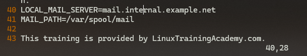
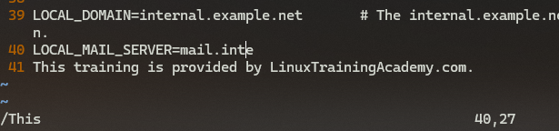
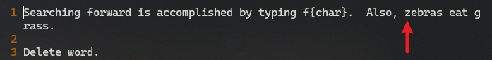
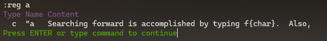

# L22 Search, Find, and Replace - Part One
---

本课同步练习文件：`vimclass/searching.txt`。


## 1 从光标位置起，正向定位到当前行的首个字符 b

按 <kbd>F</kbd><kbd>B</kbd>（即 <kbd>F</kbd> + `{char}`）

查找该行首个大写字母 `A`：按 <kbd>F</kbd> + <kbd>Shift</kbd><kbd>A</kbd>

注意：`f` 键查找是 **区分大小写** 的。


## 2 从光标位置起，反向查找某个字符

反向查找：<kbd>Shift</kbd><kbd>F</kbd> + `{char}`。例如，反向定位到光标左边最近一个 `z`，按：<kbd>Shift</kbd><kbd>F</kbd> + <kbd>Z</kbd>。

正向查找：forward search

反向查找：backward search / reverse search


## 3 重复上一次字符查找操作

正向重复查找，按 <kbd>;</kbd>

反向重复查找，按 <kbd>,</kbd>


## 4 定位到目标字符的前一个字符

正向：按 <kbd>T</kbd> + `{char}`

反向：按 <kbd>Shift</kbd><kbd>T</kbd> + `{char}`

例如，正向定位下一个 `i` 左边（前一个）的字符：<kbd>T</kbd><kbd>I</kbd>

再如，反向定位上一个 `i` 右边（即反向的前一个）的字符：<kbd>Shift</kbd><kbd>T</kbd> + <kbd>I</kbd>

同理，可使用 <kbd>;</kbd> 和 <kbd>,</kbd> 分别重复定位到下一个 `{char}`、且在它前面（正向为左边，反向为右边）的那个字符。

注意，无论是 `f` 查找还是 `t` 查找，<kbd>;</kbd> 始终与上一次查找的方向保持一致；而 <kbd>,</kbd> 始终与上一次的方向相反。

此外，这两类查找也支持数量词 `{count}`。例如，从当前位置开始，正向查找当前行的第 2 个空格字符，需键入：<kbd>2</kbd><kbd>F</kbd><kbd>Space</kbd>

> [!tip]
>
> **【复习】**
>
> 重复上一次 `Vim` 命令，用的是 <kbd>.</kbd>；而这里的 `f` 查找和 `t` 查找对应的是动作 `motion`，并且可能存在多个匹配项，所以只能按 <kbd>;</kbd> 或 <kbd>,</kbd> 进行正反向浏览。
>
> 与此同时，也正因为这些查找属于 `motion` 动作，而非 `command` 命令，它们也可以和前面学过的其它 `command` 命令组合使用（如 `c` / `d` / `y` 命令等）


## 5 单字符查找与 Vim 命令的组合

对于下列文本内容：

```markdown
Delete THIS<<--- word.
```

按 <kbd>F</kbd> + <kbd>Shift</kbd><kbd>T</kbd> 将光标定位到大写字母 `T` 后，需要删除字符 `T`（包含）到字符 `w`（不包含）之间的内容，至少有三种解决方案：

- 用 <kbd>D</kbd> + <kbd>T</kbd><kbd>W</kbd>
- 用 <kbd>D</kbd> + <kbd>F</kbd><kbd>Space</kbd>
- 还可以用前面介绍的 <kbd>D</kbd> + <kbd>Shift</kbd><kbd>W</kbd>


## 6 跨行查找某字符串

使用 <kbd>/</kbd> + `{target_string}`

例如：正向跨行查找字符串 `and`：<kbd>/</kbd> + `and`

正向快速匹配下一个目标，按：<kbd>N</kbd>

反向快速匹配，则按：<kbd>Shift</kbd><kbd>N</kbd>

一直按 <kbd>N</kbd> 匹配到当前文件的最后一个目标字符串后，再次按 <kbd>N</kbd>，`Vim` 会提示 `search HIT BOTTOM, continuing at TOP`，并将光标定位到文件第一处匹配项（反之亦然）：


**图 22-1 跨行查找到最后一处关键字后，Vim 提示继续查找将从文件开头重新开始**

想要重新检索其他字符串，键入 <kbd>/</kbd> + `{new_string}` 即可。


## 7 Vim 的增量查找

**增量查找（incsearch，即 incremental search）** 是 `Vim` 中的一个配置项，启用该配置项后，`Vim` 会在输入搜索关键字的过程中，实时显示最新的匹配结果。也就是说，可以看到搜索结果的 **即时反馈**，而不必等到输完搜索字符串后再进行查找。

| 相关操作 |           增量搜索命令           |
| :------: | :------------------------------: |
|   查看   |  `:set is?` / `:set incsearch?`  |
|   开启   |   `:set is` / `:set incsearch`   |
|   关闭   | `:set nois` / `:set noincsearch` |
|   切换   |  `:set is!` / `:set incsearch!`  |


## 8 Vim 搜索的高亮显示

**搜索高亮显示（hls，全称 hlsearch，即 highlight search）**，默认关闭。开启后，当前文件所有的匹配项都将高亮显示，直到换成其他关键词或者关闭高亮。相关配置命令如下：

|   相关操作   |           高亮显示命令           |
| :----------: | :------------------------------: |
|     查看     |  `:set hls?` / `:set hlsearch?`  |
|     开启     |   `:set hls` / `:set hlsearch`   |
|     关闭     | `:set nohls` / `:set nohlsearch` |
|     切换     |  `:set hls!` / `:set hlsearch!`  |
| **临时关闭** |     `:nohls` / `:nohlsearch`     |

注意：临时关闭只对当前匹配结果生效；只要用 <kbd>/</kbd> 重新检索，`Vim` 就会重新恢复高亮显示。

关于 `Vim` 偏好的具体配置，后续还会重点介绍，这里暂不展开。


## 9 全局搜索与替换的快速交替操作

先用 `/{keyword}` 搜索，然后用 `cw` 等命令替换为其他关键词；后续再通过 <kbd>N</kbd> 和 <kbd>.</kbd> 快速定位、快速替换，实现快速交替操作。

例如：全文检索 `and` 并替换为 `&`，可以先用【`/and` + <kbd>C</kbd><kbd>W</kbd> + `&`】完成第一组操作，随后交替使用 <kbd>N</kbd> 和 <kbd>.</kbd> 实现快速替换。


## 10 反向全局搜索

**反向搜索（backward search，或者 reverse search）**，使用：<kbd>?</kbd> + `{keyword}`。

例如，从当前光标位置开始，反向检索关键词 `is`：<kbd>?</kbd> + `is`

同理，重复下一个匹配项（即向上查找），使用 <kbd>N</kbd>；逆向操作使用 <kbd>Shift</kbd><kbd>N</kbd>（即向下查找）。


## 11 查找光标所在的下一个单词

使用星号键 <kbd>*</kbd>。

例如：光标定位到单词 `is` 的任一字符上，键入 <kbd>*</kbd> 可以全局匹配到下一个单词 `is`，继续按 <kbd>\*</kbd> 或者 <kbd>N</kbd> 可匹配下一处；上一处用 <kbd>Shift</kbd><kbd>N</kbd>。

> [!note]
>
> **注意**
>
> <kbd>*</kbd> 只能匹配单词 `is`，无法匹配像 `episode`、`sister` 这样关键词出现在中间的情况，因为 <kbd>\*</kbd> 表示匹配完整单词（matching an entire word）。


## 12 查找光标所在的上一个单词

使用 <kbd>$</kbd>，重复该操作，使用 <kbd>\$</kbd> 或 <kbd>N</kbd>；逆向操作仍然使用 <kbd>Shift</kbd><kbd>N</kbd>。

> [!tip]
>
> **发散**
>
> 从形状上看，<kbd>#</kbd> 更像是 <kbd>\*</kbd> 的 “放大版”，形似 <kbd>\*</kbd> 的 “大写”；而 <kbd>\*</kbd> 则形似 <kbd>#</kbd> 的 “小写”。


## 13 全局搜索 motion 与 D 命令的组合应用

全局搜索本质上也属于 `motion` 操作，因此同样可以与 `command` 命令组合使用。例如，删除当前光标到下一处 `This`（不含）之间的文本内容：



**图 2：全局搜索与命令的组合示例：删除当前光标到 This 间的内容（操作前）**

键入 <kbd>D</kbd><kbd>/</kbd> + `This` + <kbd>Enter</kbd>，得到如下结果：



**图 3：执行 D/This + Enter 后的最终结果**


## 14 全局搜索 motion 与 Y 命令及寄存器的组合应用

此外，也可以将组合操作的内容放入某个寄存器。

例如：将文件初始位置到下一个 `z` 之间的内容，存入寄存器 `"a`。

操作前（光标位于起初位置）：



**图 4：Y 命令 + 全局搜索 + 寄存器操作示例（操作前）**

依次键入 <kbd>"A</kbd><kbd>Y</kbd> + <kbd>/</kbd><kbd>Z</kbd> + <kbd>Enter</kbd>，并查看寄存器 `"a` 的内容，得到如下结果：



**图 5：执行 "ay/z + Enter 操作后，查看寄存器 a 中的内容（操作成功）**


（第一部分完）


> **后记**
> `Vim` 的使用我觉得是计算机领域少有的 “先难后易” 技能，为了今后的流畅体验，现在苦一点累一点是非常值得的。能否熟练使用 `Vim` 也是评价一个人计算机综合素养的重要指标之一。
