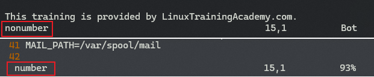
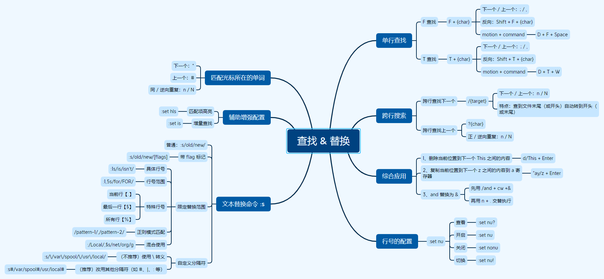

# L23 Search, Find, and Replace - Part Two
---


## 1 文本替换命令 :s/old/new/

这里的 `s` 就是 `substitute` 的首字母，表示 “替换”。

例如，将下列文本行中的 `net` 替换为 `org`：

```markdown
DOMAIN=example.net                      # The example.net doma    in.
```

可以使用如下命令：`:s/net/org/`

注意：末尾还有一个 <kbd>/</kbd>；并且该写法只能替换匹配的 **第一个关键词**。

若要实现全局替换，需加全局标记 `g`，语法为：`:s/old/new/[flags]`，本例即为 `:s/net/org/g`


## 2 指定范围的文本替换

语法：`:[range]s/old/new/[flags]`，默认范围为 **当前行**。

其中，`[range]` 范围有不同的写法：

1. 具体行号。例如，将第 1 行的 `is` 替换为 `isn't`，使用命令：`:1s/is/isn't/`。
2. 具体行号范围。例如，将 1 ~ 5 行中的 `for` 全部替换为 `FOR`：`:1,5s/for/FOR/`。
3. 使用特殊行号标识：`.` 表示当前行，`$` 表示最后一行。例如，从当前行到最后一行执行替换，`[range]` 部分写作：`.,$`。
4. 用 `%` 表示所有行（即整个文件）。例如，将当前文件中的所有 `net` 替换为 `org`，写作：`:%s/net/org/g`。
5. 范围的正则表示：`[range]` 部分语法为 `/pattern-1/,/pattern-2/`。例如，从包含 `Global` 的行开始，到包含 `Local` 的行结束，将 `net` 统一替换为 `org`：`:/Global/,/Local/s/net/org/g`。
6. 也可以将 `/pattern/` 和普通、特殊行号一起使用。例如，将 `net` 全部替换为 `org`，指定范围从 `Local` 开始、并到当前文件末尾结束，可以写作：`:/Local/,$s/net/org/g`。


## 3 特例：路径的替换

特殊情况下，如果需要用 `:s/old/new/` 命令对 **路径内容** 进行替换，例如将 `MAIL_PATH=/var/spool/mail` 替换为 `MAIL_PATH=/usr/local/mail`。此时由于路径分隔符和 `:s` 命令的分隔符相同（如 `Linux`、`Unix`、`MacOS` 等环境下），实现这类替换有两种方法：

1. 常规方法：使用 `\` 进行转义，写作：`:s/\/var\/spool/\/usr\/local/`
2. 使用其他字符作 `:s` 命令的分隔符，例如改为 `#`，写作：`:s#/var/spool#/usr/local#`。

第一种方法虽然简单，但可读性很差，也很容易出错。第二种方式更加简便灵活，因此强烈推荐使用第二种。除了用 `#` 分隔，还可以用管道符号 `|` 或者 `:` 进行分隔，只要是 **单个的非数字、非字母字符（single non-alphanumberic character）** 即可。

> [!note]
>
> **注意**
>
> 其实 `/var/spool` 前面的 `/` 可以不参与替换，这样更简便。但为了更好地演示自定义 `:s` 命令的分隔符，还是决定保留下来以示区别。


## 4 文件行号的配置

本节反复提到文件行号的使用，是时候好好讲讲行号的配置了：

|   行号状态   | 行号配置命令 |
| :----------: | :----------: |
|   开启行号   |  `:set nu`   |
|   关闭行号   | `:set nonu`  |
| 查看当前状态 |  `:set nu?`  |
| 切换行号开关 |  `:set nu!`  |

注意：`nu` 的全称为 `number`，上述命令也可以使用 `number` 替换 `nu`。查看当前状态时，若未启用行号，`Vim` 状态栏将显示 `nonumber`；已开启行号则显示 `number`：



**图 1：使用 :set nu? 命令显示的不同 Vim 状态对比情况**


## 5 要点总结

这是官方给的知识点梳理，感觉没我自己整理的思维导图细致（哈哈）

### （1）搜索当前行（Same Line Searching）

- `f{char}`：Forward search
- `F{char}`：Reverse search
- `t{char}`：Forward till search
- `T{char}`：Reverse till search
- <kbd>;</kbd>：Repeat in the same direction
- <kbd>,</kbd>：Repeat in the opposite direction


### （2）跨行搜索（Searching）

- `/{pattern}`：Forward search
- `?{pattern}`：Reverse search
- `n`：Repeat search in the same direction
- `N`：Repeat search in the opposite direction
- <kbd>\*</kbd>：Forward search for word
- <kbd>#</kbd>：Reverse search for word


### （3）替换命令（Substitute Command）

语法：`:[range]s/{pattern}/{string}/[flags]`

例如在当前文件内实现全局替换：`:%s/{pattern}/{string}/g`

此外，还可以在命令前添加数量词 `[count]`，或者与 `motion` 操作进行组合，实现更多灵活多变的替换效果。


最后，给出我自己归纳的 L22~L23 `Vim` 查找与替换的思维导图：



**图 2：Vim 查找与替换部分（L22 + L23）思维导图**
