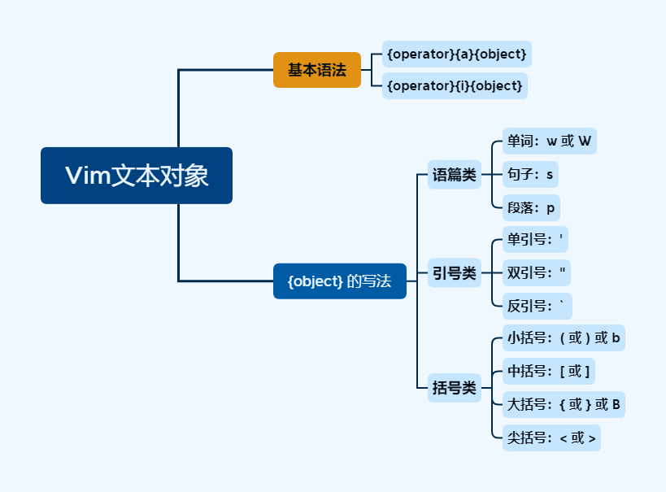

# L28 Text Objects
---

本节演示文件：`vimclass/textobjects.txt`。


## 1 文本对象的含义

`Vim` 中的 **文本对象（Text Objects）**（又叫 **逻辑区域（Logical Regions）**）主要包括：

- 单词
- 句子
- 段落
- 各种标点符号分隔的文本，如：
  - 引号（单引号、双引号）
  - 反引号
  - 大括号
  - `HTML` 标签


## 2 操作文本对象的基本语法

语法一：

```markdown
{operator}{a}{object}
```

语法二：

```markdown
{operator}{i}{object}
```


## 3 操作光标所在的整个单词

删除整个单词：

<kbd>D</kbd><kbd>A</kbd><kbd>W</kbd>：即 **D**elete **A** **W**ord（带对象分隔符，<kbd>A</kbd> 表示 `around` 或 `all`）

更改整个单词：

<kbd>C</kbd><kbd>I</kbd><kbd>W</kbd>：即 **C**hange **I**nner **W**ord（不带对象分隔符，<kbd>I</kbd> 表示 `inner`）

此外，`{object}` 指代 “单词” 时（即 `w` 与 `W`）也有大小写的区别，主要体现在 **对象分隔符** 的认定上：

- 小写形式（即 <kbd>W</kbd>）：对象分隔符包括 **标点符号** 和 **空白字符**
- 大写形式（即 <kbd>Shift</kbd><kbd>W</kbd>）：对象分隔符只包含 **空白字符**


## 4 删除光标所在的整个句子

句子（Sentence）对应的 `{object}` 为 `s`，例如以下操作指令：

- <kbd>D</kbd><kbd>A</kbd><kbd>S</kbd>：删除光标所在的一整句话，包括该句子的 **句点位置，以及句点后面的空白字符**。
- <kbd>D</kbd><kbd>I</kbd><kbd>S</kbd>：删除光标所在的一整句话，**且仅删到句点位置（含）**。

此外，对于句子中出现换行的情况，`Vim` 也能自动视为同一句话，一并处理。例如，对于下列三句话，如果需要删除第二句，操作前如下所示（假设光标位于单词 `multiple` 上）：

```markdown
This is a sentence comprised of many words.  This is another sentence. A 
paragraph is made up of multiple sentences.  Just like this one!
```

执行操作 <kbd>D</kbd><kbd>A</kbd><kbd>S</kbd>，得到：

```markdown
This is a sentence comprised of many words.  This is another sentence. Just like this one!
```

重复上述操作，还可以使用快捷键 <kbd>.</kbd>。


## 5 操作光标所在的整个段落

在 `Vim` 中，一句话是以句点 `.` 结尾的；而一个段落则是用 **空行** 进行分隔的。段落对应的对象表示为 `p`，即段落的英文单词 `paragraph` 的首字母，相关操作如下（以 `d` 命令为例）：

- <kbd>D</kbd><kbd>A</kbd><kbd>P</kbd>：删除当前光标所在的一整段文本，以及该段落后面的空行。
- <kbd>D</kbd><kbd>I</kbd><kbd>P</kbd>：仅删除当前光标所在的一整段文本，段落后面的空行不动。


## 6 删除光标所在的中括号内的文本

中括号对应的文本对象用 `[` 或 `]` 表示，二者含义相同，都指代中括号圈定的文字，与 <kbd>A</kbd> 结合表示包含括号本身，与 <kbd>I</kbd> 组合则仅针对其中的文本。例如：

- <kbd>D</kbd><kbd>A</kbd><kbd>[</kbd> 或 <kbd>D</kbd><kbd>A</kbd><kbd>]</kbd>：删除当前光标所在的、由中括号圈定的文本内容，且包含中括号本身；
- <kbd>C</kbd><kbd>I</kbd><kbd>[</kbd> 或 <kbd>C</kbd><kbd>I</kbd><kbd>]</kbd>：更改当前光标所在的、由中括号圈定的文本内容，但保留中括号本身。


## 7 删除光标所在的小括号内的文本

在 `Vim` 中，小括号对应的文本对象用 `(` 或 `)` 表示；包含小括号用 `a`，不包含则与 `i` 组合。例如：

- <kbd>D</kbd><kbd>A</kbd><kbd>(</kbd> 或 <kbd>D</kbd><kbd>A</kbd><kbd>)</kbd>：删除当前光标所在的小括号圈定的文本内容，且包括小括号本身一并删除。
- <kbd>D</kbd><kbd>I</kbd><kbd>(</kbd> 或 <kbd>D</kbd><kbd>I</kbd><kbd>)</kbd>：删除当前光标所在的小括号圈定的文本内容，但保留小括号本身。

同时，小括号还可以用 `b` 表示，意指 `block` 区块，同时也省去了多按一次 <kbd>Shift</kbd> 键的麻烦。


## 8 操作尖括号内的文本

在 `Vim` 中，尖括号对应的文本对象用 `<` 或 `>` 表示，包含则用 `a`，不包含与 `i` 组合。例如，对 `<html>` 作如下操作：

- <kbd>Y</kbd><kbd>A</kbd><kbd><</kbd> 或 <kbd>Y</kbd><kbd>A</kbd><kbd>></kbd>：复制（Yank）光标所在的尖括号圈定的文本，且包含尖括号本身（即复制 `<html>`）；
- <kbd>Y</kbd><kbd>I</kbd><kbd><</kbd> 或 <kbd>Y</kbd><kbd>I</kbd><kbd>></kbd>：复制（Yank）光标所在的尖括号圈定的文本，但不包含尖括号本身（即复制 `html`）；


## 9 操作光标所在的标签文本

在 `Vim` 中，标签对应的文本对象为 `t`（即 `tag` 的首字母）。包含标签与 `a` 组合，不包含则与 `i` 组合。例如，删除下列文本中 `p` 标签内的文字（不含 `p` 标签本身）：

```html
<p>This is <strong>so, so, very</strong> cool!</p>
```

按 <kbd>D</kbd><kbd>I</kbd><kbd>T</kbd>，得到：

```html
<p></p>
```

> [!note]
>
> **注意**
>
> 当标签只存在嵌套的其他标签时，光标必须正确定位，因为 `t` 只对当前光标所在的最近一层的标签生效。因此，如果光标位于 `<strong>` 内，则只对 `<strong>` 圈定的文字生效，而位于 `p` 内部、`strong` 外部的文字则不受影响。
>
> 此外，对于自定义的标签（如 XML 或自定义组件标签），`at` 与 `it` 操作同样适用。


## 10 操作大括号内的文本

同理，大括号对应的文本对象用 `{` 或 `}` 表示，且与 `a` 组合表示包含大括号本身，与 `i` 组合表示不包含大括号。与标签的情况类似，存在嵌套时，也仅对当前光标所在的最内层大括号生效。

同时，也可以用 `B` 表示大括号文本对象，与小括号的 `b` 相对。这里也体现了 `Vim` 的形象化思维：小括号用小写的 `b` 表示（即小写的 `block` 区块）；大括号用大写的 `B` 表示（对应大写的 `Block` 区块）。


## 11 操作光标所在的各种括号内的文本

- 双引号：<kbd>A</kbd><kbd>"</kbd>、<kbd>I</kbd><kbd>"</kbd>
- 单引号：<kbd>A</kbd><kbd>'</kbd>、<kbd>I</kbd><kbd>'</kbd>
- 反引号：<kbd>A</kbd><kbd>\`</kbd>、<kbd>I</kbd><kbd>\`</kbd>


## 12 本节思维导图


