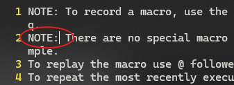

# L31 Macros
---

本节演示文件：`vimclass/macros.txt`。


## 1 宏的用途

宏的出现，旨在实现一系列复杂的 `Vim` 命令的重复操作。

在 `Vim` 中，宏又叫 **complex repeats**（复杂的重复命令），它是对简单重复命令 <kbd>.</kbd> 的一大扩展。

宏的主要用途：

- 对数据和文本的格式化处理
- 变更 `CSV` 文件中的列
- 删除行内的多余文字
- 数据清理

总之，遇到需要重复实现复杂且冗长的编辑任务时，都应该考虑启用 `Vim` 的宏（`macro`）。


## 2 Vim 宏的原理及创建方法

`Vim` 宏本质上是对特定按键序列的录制。这些录好的按键序列将存放于某个寄存器中，以便后续回放时精确重复录制时的所有按键操作。

宏的限制条件：不能在录制某个宏的过程中同时录制其他的宏。

开始录制宏：`q{register_name}`。例如，将宏录制到寄存器 `"a` 中，需键入：<kbd>Q</kbd><kbd>A</kbd>。此时 `Vim` 左下角将出现相应提示信息（本节后面均以 `Windows` 下的 `Vim` 进行演示）：


**图 31-1：Windows 下的 Vim 宏录制提示信息（v9.1）**


**图 31-2：WSL 下的 Vim 宏录制提示信息（v8.1）**

结束宏录制：再按一次 `q`。

宏的执行：`@{register_name}`，例如，执行寄存器 `"a` 中的宏，需输入：`@a`


## 3 录制宏示例：在行首插入 `NOTE: `

按 <kbd>Q</kbd><kbd>A</kbd> + <kbd>Shift</kbd><kbd>I</kbd> +`NOTE: ` + <kbd>Escape</kbd> + <kbd>Q</kbd>

查看录好的宏，输入：`:reg a` + <kbd>Enter</kbd>


**图 31-3：查看录到寄存器 "a 的宏内容示意图**

其中 `^[` 表示按键 <kbd>Escape</kbd>。

对第二行文本执行宏命令，操作前：


**图 31-4：执行宏命令前，先将光标移至第 2 行**

然后执行命令 `@a`：



**图 31-5：执行宏命令 @a 后，第二行行首自动插入指定内容**


## 4 快速执行最后一次宏任务

按 <kbd>@</kbd><kbd>@</kbd>


## 5 Vim 宏录制的最佳实践

`Vim` 宏录制的操作顺序最佳实践：

创建Vim宏的最佳实践：

1. 统一设置光标位置（Normalize the cursor position）
   1. 例如键入 <kbd>0</kbd>（即回零操作）
2. 执行具体的编辑与相关操作（Perform edits and operations）
3. （结束录制前）重新定位光标，以便连续操作（Position your cursor to enable easy replays）
   1. 例如键入 <kbd>J</kbd>


## 6 示例：在行首插入 `TIP: ` 并存入寄存器 `"b`

录制前：


**图 31-6：录制宏之前的文本内容**

录制并执行宏后的效果：


**图 31-7：录制宏并执行该宏后的文本内容**

具体做法：定位到第 11 行后，依次键入——

<kbd>Q</kbd><kbd>B</kbd> + <kbd>0</kbd> + <kbd>I</kbd> + `TIP: ` + <kbd>Escape</kbd> + <kbd>J</kbd> + <kbd>Q</kbd>

其中的 <kbd>0</kbd> 和 <kbd>J</kbd> 分别用于控制光标的起点与终点位置，以便连续重复回放。

录制完毕，**另一项最佳实践** 是先检查寄存器 `"b` 中的宏内容。

输入 `:reg b` + <kbd>Enter</kbd>，如下图所示：


**图 31-8：宏录制完毕后，检查寄存器 "b 中的内容**

然后按 <kbd>@</kbd><kbd>B</kbd> 执行宏操作，重复执行四次；或者按 <kbd>@</kbd><kbd>@</kbd> 四次；或者添加数量词，按 <kbd>4</kbd><kbd>@</kbd><kbd>B</kbd> 或 <kbd>4</kbd><kbd>@</kbd><kbd>@</kbd> 完成剩余行的批量操作。


## 7 录制宏示例：删除当前行的 FIRST NAME 和 LAST NAME

试通过 `Vim` 的宏录制，将形如下列样式的文字（第 17 至 21 行）：

```markdown
FIRST NAME: Joseph LAST NAME: Andrews
```

批量改为：

```markdown
Joseph Andrews
```

要求相关宏操作放入寄存器 `"c` 中。

为此，先将光标定位到第 17 行，然后依次输入——

<kbd>Q</kbd><kbd>C</kbd> + <kbd>0</kbd> + `2dW` + <kbd>F</kbd><kbd>Shift</kbd><kbd>L</kbd> + <kbd>.</kbd> + <kbd>J</kbd> + <kbd>Q</kbd>

（由于同种效果有多种具体实现方式，这里仅举一例）

宏录制结束后，查看寄存器 `"c` 中的内容：


**图 31-9：录制结束后，查看寄存器 "c 中的宏内容**

注意，这里多出的 `<80><fd>a` 可能是 `Windows` 版本差异导致的，在 `WSL` 版的 `Vim` 中同样的录制操作则显示正常：


**图 31-10：WSL 环境下的 Vim 录制宏内容查询结果（无多余字符）**

批量执行宏前：


**图 31-11：录至宏后、批量执行宏操作前的文字内容**

输入 `4@c` 或 `4@@` 批量操作后：


**图 31-12：批量执行宏操作后的文字效果**


## 8 录制宏示例：更复杂的单行内容格式化

试通过 `Vim` 的宏录制功能（存入寄存器 `"d`），实现下列格式化效果——

宏操作前：

```markdown
"Montgomery", "(Alabama)" => "usa"
```

宏操作后：

```markdown
'Montgomery', 'Alabama', 'USA'
```

完成宏录制后，对第 26 至 35 行的类似文本进行批量处理：


**图 31-13：需要用录制的宏批量处理的文本行**

为此，可以分为以下几步执行：

1. 双引号批量替换为单引号：`:s/"/'/g`
2. 删除小括号：`:s/(//`、`:s/)//`
3. 替换箭头符号：`:s/ =>/,/`
4. `usa` 转大写形式：`:s/usa/USA/`（也可以用 `gUw`）

于是可以依次键入——

<kbd>Q</kbd><kbd>D</kbd> + <kbd>0</kbd> + `:s/"/'/g` + <kbd>Enter</kbd> + `:s/(//` + <kbd>Enter</kbd> + `:s/)//` + <kbd>Enter</kbd> + `:s/ =>/,/` + <kbd>Enter</kbd> + `:s/usa/USA/` + <kbd>Enter</kbd> + <kbd>J</kbd> + <kbd>Q</kbd>

查看寄存器 `"d` 中的内容：


**图 31-14：查看寄存器 "d 中的宏操作**

可以看到，<kbd>Enter</kbd> 在寄存器中用 `^M` 标识。

然后批量执行 `"d` 中的宏即可。


> [!tip]
>
> **关于 => 的叫法**
>
> 课程中顺便提到了箭头符号 `=>` 的叫法，有点意思——
>
> - a fat comma（胖逗号？）
> - a hash rocket（哈希火箭？）
> - a fat arrow（胖箭头？）


## 9 在命令模式下按指定范围批量执行 Vim 宏

批量操作时，如果需要对当前文件的 **所有的行** 执行宏操作，也可以添加数量词：`[count]@{macro_name}`，其中的总行数可通过 <kbd>Ctrl</kbd> + <kbd>G</kbd> 获得。

此外，`Vim` 提供了更为灵活的方式来指定宏操作生效的特定范围。该方法需要在命令模式下执行，其语法为：

`<colon>{range}normal<space>@{macro_name}`

例如，对第 27 至 35 行执行录制到寄存器 `"d` 中的 `Vim` 宏，需要在命令模式下输入：

`:27,35normal @d` + <kbd>Enter</kbd>

实测结果如下：


**图 31-15：按指定范围批量执行宏操作后的结果界面**

此外，要表示从当前行到文件最后一行，可以使用 `.,$`


## 10 示例：Vim 宏的跨行操作

假设有如下所示的跨行文本内容：

```markdown
amazon.com has address: 
54.239.17.7

google.com has address:
216.58.192.78

```

试通过 `Vim` 的宏录制（录制到寄存器 `"e` 中），将示例文件中的类似文本行统一处理成如下格式：

```markdown
54.239.17.7 amazon.com
216.58.192.78 google.com
```

具体实现：光标定位到指定行后（本例即为第 37 行），依次键入——

<kbd>Q</kbd><kbd>E</kbd> + <kbd>0</kbd> + <kbd>J</kbd><kbd>Shift</kbd><kbd>D</kbd> + <kbd>K</kbd><kbd>Shift</kbd><kbd>P</kbd> + <kbd>A</kbd><kbd>Space</kbd> + <kbd>Escape</kbd> + `/ h` + <kbd>Enter</kbd> + <kbd>Shift</kbd><kbd>D</kbd> + <kbd>J</kbd><kbd>2</kbd><kbd>D</kbd><kbd>D</kbd> + <kbd>Q</kbd>

> [!warning]
>
> **注意**
>
> 这里没有按照最佳实践的推荐做法、在录制结束前用 <kbd>J</kbd> 定位光标，原因是删除空行后，光标已经自动进入下一行了。实际操作中也要根据具体情况酌情调整，切忌生搬硬套。

宏录制完毕后，先查看寄存器 `"e` 中的内容，输入 `:reg e` + <kbd>Enter</kbd>，得到如下结果：


**图 31-16：查看寄存器 "e 中的宏操作内容**

批量执行时，由于待处理内容只有两段，因此任选一种方式即可：

1. 重复按两次 <kbd>@</kbd><kbd>E</kbd>；
2. 重复按两次 <kbd>@</kbd><kbd>@</kbd>；
3. 输入 <kbd>2</kbd><kbd>@</kbd><kbd>@</kbd>；
4. 命令模式下指定执行范围：`:38;40normal @e` + <kbd>Enter</kbd>

> [!tip]
>
> **注意事项**
>
> 1. 本例中，若光标位于行首，删除当前行的内容用的是 <kbd>Shift</kbd><kbd>D</kbd> 而不是 <kbd>D</kbd><kbd>D</kbd>，因为后者会包含换行符，从而让处理操作多出一步；而前者就能避免这样的问题。
> 2. 在命令模式下指定连续的行范围，用的是逗号 `38,40`；而仅对这两行执行宏操作，则要使用 `38;40`。注意二者的区别。精确指定范围可以避免一些无谓的 `Vim` 错误提示。


## 11 Vim 宏命令的编辑

以介绍最佳实践前录制到寄存器 `"a` 的 `Vim` 宏为例：假设要将之前插入的 `NOTE: ` 改为 `A NOTE: `，则可以先将 `"a` 中的内容粘贴到某个空行内，完成修改后再拷回 `"a` 即可。

具体操作如下——

1. 光标先定位到某个空行（比如第 40 行）：`40gg`

2. 粘贴 `"a` 中的内容：`"ap`

   

3. 修改具体内容：`0aA ` + <kbd>Escape</kbd>

   

4. 重新复制整行内容到寄存器 `"a`：`0"ay$`

5. 重新确认寄存器 `"a` 中的内容：`:reg a` + <kbd>Enter</kbd>

   

最后任选一行进行测试，看看修改是否生效（例如选定第 41 行）：<kbd>J</kbd> + `@a`


**图 31-17：实测修改后寄存器 "a 中的 Vim 宏效果（符合预期）**


## 12 Vim 宏的保存

为了让宏操作永久有效，可以将 `Vim` 宏添加到 `viminfo` 文件中永久保存。

`viminfo` 文件位于当前帐号主目录下，其中包含了很多历史命令、历史查询结果、以及非空的寄存器。

`viminfo` 的文件名视操作系统有所不同 ——

- `Unix` / `Linux` / `MacOS` 系统：`.viminfo`
- `Windows` 系统：`_viminfo`

将 `Vim` 宏写入 `.viminfo` 的利弊分析：

- 利：非空寄存器第二次打开时，可以直接读取、调用 `Vim` 宏
- 弊：如果该寄存器被篡改，则之前创建的宏将被覆盖

为了消除上述弊端，只能将指定的宏存入某些人为指定的寄存器，然后寄希望于后续编辑过程中不要改到这些寄存器（显然不太现实）。

为此，`Vim` 提供了 `vimrc` 文件来解决这个问题。

`vimrc` 文件负责 `Vim` 的初始化工作，其文件名在不同操作系统下同样有所区别——

- `Windows` 系统：`_vimrc`
- `Unix` / `Linux` / `MacOS` 系统：`.vimrc`

具体做法：定位一处空文本行，编辑好要写入 `vimrc` 文件的 **寄存器赋值语句**，然后存入该文件（具体设置详见后续相关课程，本节仅介绍赋值语句的构建）。

### 构建 vimrc 文件中的寄存器赋值语句

该语法即定义一个变量，比如寄存器 `"d`，需写作：`@d`。赋值语句的完整格式如下：

> `let @d = '0:s/"/'/g^M:s/(//^M:s/)//^M:s/ =>/,/^M:s/usa/USA/^Mj'`

其中单引号内的按键序列即为该寄存器的具体内容。如果序列中需要单引号，赋值语句两边的引号可以改为双引号。

对于复杂指令的编辑，也可以先将其粘贴到文件某个空行，编辑好后再写入 `vimrc` 文件。这样，即便中途不小心覆盖了录制好的宏内容，也可以重启 `Vim` 进行恢复（`Vim` 会在初始化启动过程中对该寄存器重新赋值）。


> [!note]
>
> **注意特殊符号的录入**
>
> 需要特别注意的是，编辑过程中，诸如 <kbd>Escape</kbd>、<kbd>Enter</kbd> 这样的特殊符号，需要先输入 <kbd>Ctrl</kbd><kbd>V</kbd>，然后再键入相应的特殊按键，这样才能完成特殊符号的录入。千万不可直接手动输入 `^[` 或 `^M`，因为 `Vim` 无法正确解析。
>
> 如果是在 `Windows` 版的 `Vim` 插入模式输入特殊符号，则需要先输入 <kbd>Ctrl</kbd><kbd>Q</kbd>（否则用 <kbd>Ctrl</kbd><kbd>V</kbd> 会将剪切板中的内容粘贴到文件中），然后再键入特殊按键即可。


## 13 本节知识点回顾

- `Vim` 中的宏（`macros`）的本质是一组录制好的按键序列（series of keystrokes）；
- `Vim` 宏存放在 `Vim` 的寄存器（`registers`）中；
- 宏的启动：`q{REGISTER}`
- 宏操作的追加：`q{CAPITAL_REGISTER}`（与寄存器的追加方法相同）
- 宏的调用、回放：`@{REGISTER}`
- 重复执行最近一次回放的宏操作：`@@`
- 开始录制后，最好用 <kbd>0</kbd> 让光标“回零”；
- 录制结束前，利用 <kbd>J</kbd> 让光标定位到下一行，以便下一次连续调用；
- 指定宏操作的特定范围：`:[range]normal @{REGISTER}`
  - 例如：`:3,47 normal @q` + <kbd>Enter</kbd>
- 多次重复 `Vim` 宏：`[count]@{REGISTER}`
- 将 `Vim` 宏存入 `vimrc` 文件：`let @[REGISTER] = 'keystrokes'`
