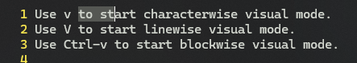
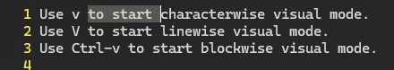
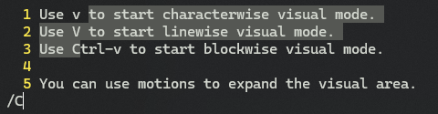
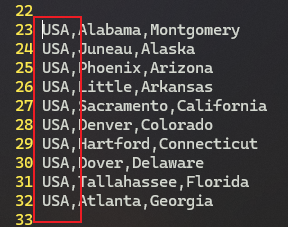
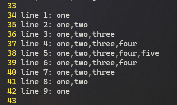
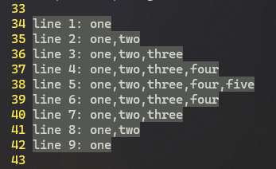
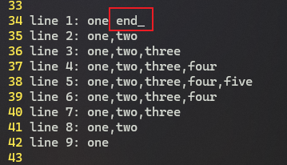
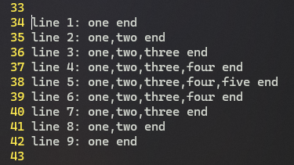
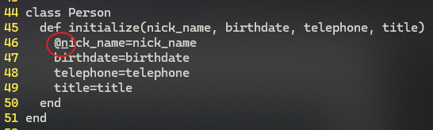
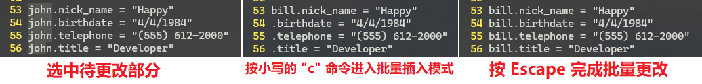

# L34 Visual Mode - Part 1
---

本节演示文件：`vimclass/visual.txt`。


## 1 Vim 可视化模式的应用场景

`Vim` 的可视化模式与图形界面下的文本鼠标操作类似，甚至更强。常见的应用场景：

- 选中多行垂直文本块，并支持对多行内容进行批量处理；
- 在 `Vim` 指令生效前，方便查看 `Vim` 都选中了哪些内容；
- 启用可视化模式后，鼠标操作没有了，从而节约了大量键鼠切换时间。


## 2 Vim 的三种可视化模式

1. 字符级（characterwise）可视化模式：通过 `v` 开启；
2. 文本行（linewise）可视化模式：通过 `V` 开启；
3. 区块级（blockwise）可视化模式：通过 <kbd>Ctrl</kbd> + <kbd>V</kbd> 开启（WSL 的 Ubuntu Vim 用的是 <kbd>Ctrl</kbd> + <kbd>Alt</kbd> + <kbd>V</kbd>；`Windows` 的 Vim 则用的是 <kbd>Ctrl</kbd> + <kbd>Q</kbd>）；

可视化模式的退出：任意位置按 <kbd>Escape</kbd> 键。


## 3 字符级可视化模式的基本操作

在可视化模式下，可以使用 `motion` 移动来选中某个区域，效果与 `Windows` 下 <kbd>Shift</kbd> + <kbd>方向键</kbd> 类似。但 `Windows` 仅支持单个字符的移动，最多配合 <kbd>Ctrl</kbd> 键实现基于单词的移动；而 `Vim` 中的所有 `motion` 移动都能用于定义某个选中区域。

### 【示例一】可视化 + 方向键

例如，将光标定位到字符 `t` 后，通过 <kbd>V</kbd> 键开启字符级可视化模式，再按 <kbd>L</kbd> 令光标右移：



**图 34-1：按 v 开启字符级可视化模式后，右移光标后的实测效果**

### 【示例二】可视化 + <kbd>W</kbd>

接着按 <kbd>W</kbd> 键扫过单词 `start`：



**图 34-2：继续按 w 扫过单词 start 的视觉效果**

选定文字区域后，可以执行相应的命令，例如 `d` 命令删除选中内容。

### 【示例三】可视化 + 文本搜索

从光标当前位置（`t` 字符处）选中下一个字符 `C` 之间的内容，输入 `/C` 即可：



**图 34-3：字符级可视化模式下，输入 /C 可选中光标当前位置到下一处大写字符 C 之间的内容**


## 4 小写字母 o 的作用

默认情况下，开启可视化模式并选中某个区域后，当前光标会位于该区域的末尾。键入小写的 <kbd>O</kbd> 键后，光标会切换到该区域的起始位置，这样就能保留之前的内容，并沿反方向扩展该区域。

这里的 `o` 表示 **o**ther side of the region，即 **另一边**。再按一次 <kbd>O</kbd> 键，光标又重新回到另一边。

如果不切换光标位置直接反向移动，之前选中的区域将被抹除。


## 5 可视化模式 + 文本对象操作

<kbd>V</kbd><kbd>A</kbd><kbd>W</kbd>：可视化选中当前光标所在单词

<kbd>V</kbd><kbd>A</kbd><kbd>P</kbd>：可视化选中当前光标所在段落

> [!tip]
>
> **注意**
>
> 正常模式下的很多操作与可视化模式的顺序是反的：正常模式的 `yap` 对应可视化模式的 `vapy`。
>
> 正常模式先确定操作，再指定范围；可视化模式先确定范围，后追加操作。


## 6 文本行可视化模式的用法

在当前行的任意位置输入 <kbd>Shift</kbd><kbd>V</kbd> 将启用文本行可视化模式，并选中光标所在的一整行内容。

此时左右移动只会改变光标位置，当前行的选中区域一直不变；而上下移动则会将光标所在的行全部选中。

同理，使用小写字母 <kbd>O</kbd> 可以让光标从最后一行切换到首行，再按一次则还原。


## 7 快速选中上一次可视化模式选中的区域

使用 <kbd>G</kbd><kbd>V</kbd>


## 8 可在选中区域执行的常见操作

`~`： Switch case，切换大小写
`c`： Change，变更
`d`： Delete，删除
`y`： Yank，复制
`r`： Replace，替换
`x`： Delete，删除当前字符
`I`： Insert，从行首进入插入模式
`A`： Append，从行尾进入插入模式
`J`： Join，连接文本行
`u`： Make lowercase，转为小写
`U`： Make uppercase，转为大写
`>`： Shift right，向右缩进
`<`： Shift left，向左缩进


## 9 区块级可视化模式的用法示例

实测发现，`WSL` 环境下，`Ubuntu` 系统安装的 `v8.0` 版 `Vim` 的 <kbd>Ctrl</kbd> + <kbd>V</kbd> 与宿主机 `Windows` 中的粘贴快捷键冲突，进入区块模式只能使用 <kbd>Ctrl</kbd> + <kbd>Alt</kbd> + <kbd>V</kbd> 来启用；。

与前两个可视化模式不同，在区块模式下，对于选中的矩形区域，光标在四个角落的定位可以用 <kbd>O</kbd> 键或者组合键 <kbd>Ctrl</kbd> + <kbd>O</kbd> 进行切换。其中——

- <kbd>O</kbd> 键负责对角线上的两个光标位置间的切换；
- <kbd>Ctrl</kbd> + <kbd>O</kbd> 则负责同一行上首尾光标位置的切换。


### 【示例一】用区块模式将指定内容批量改为大写形式

先用区块可视化模式选中要更改的文字区域：


**图 34-4：先用区块级可视化模式选中待更改区域**

接着按 <kbd>U</kbd> 将该区域的所有字符批量改为大写格式：



**图 34-5：按 Shift + U 实现选中文字批量转为大写格式**


### 【示例二】用区块级可视化模式批量选中非标准矩形内容

区块级可视化模式下，选中区域一般为矩形，但并不是只能选中矩形。例如：



**图 34-6：待选中的不规则文字区域**

实现方法：先选中最大的矩形区域，再按 <kbd>$</kbd> 分别扩展到每一行的末尾：



**图 34-7：用区块级可视化模式选中不规则区域的效果图**


### 【示例三】在行尾批量添加文字内容

此时按 <kbd>Shift</kbd><kbd>A</kbd>（只能用大写的 `A`，小写 `a` 在可视化模式下无效）还可以批量添加文字，例如添加 `end`：



**图 34-8：新追加到行尾的内容（当前为插入模式）**

然后按 <kbd>Escape</kbd> 回到正常模式，新增内容就批量追加到每行末尾了：



**图 34-9：在行尾批量添加文字后的效果（当前为正常模式）**


### 【示例四】在行首批量插入指定字符

试将如下构造函数中的变量名改为以 `@` 开头的形式：

```python
class Person
  def initialize(nick_name, birthdate, telephone, title)
    nick_name=nick_name
    birthdate=birthdate
    telephone=telephone
    title=title
  end
end
```

最终效果如下：

```markdown
class Person
  def initialize(nick_name, birthdate, telephone, title)
    @nick_name=nick_name
    @birthdate=birthdate
    @telephone=telephone
    @title=title
  end
end
```

实现方法：光标定位到 `nick_name` 首字符，按 <kbd>Ctrl</kbd> + <kbd>Q</kbd>（Windows 环境的 Vim）进入区块级可视化模式，并按 <kbd>3</kbd><kbd>J</kbd> 选中要变更的行，然后按 <kbd>Shift</kbd><kbd>I</kbd> 批量进入插入模式（和追加内容类似，这里仅支持大写的 `I` 进入插入模式，可视化模式下小写的 `i` 无效）。接着键入 <kbd>N</kbd>：



**图 34-10：批量插入模式下，输入需要的内容 @ 的实测截图**

最后按 <kbd>Escape</kbd> 键完成各行的批量添加。


### 【示例五】用区块模式批量更改文字内容

试用区块级可视化模式将如下内容中的 `john`：

```markdown
john.nick_name = "Happy"
john.birthdate = "4/4/1984"
john.telephone = "(555) 612-2000"
john.title = "Developer"
```

批量改为 `bill`：

```markdown
bill.nick_name = "Happy"
bill.birthdate = "4/4/1984"
bill.telephone = "(555) 612-2000"
bill.title = "Developer"
```

实现方法：先将光标定位到第一个 `john` 的首字母，再启用区块级可视化模式，并选中所有的 `john` 部分；接着按 <kbd>C</kbd> 进入批量更改，输入 `bill` + <kbd>Escape</kbd> 即可。



**图 34-11：用 c 命令实现区块级可视化模式下的文本批量修改**

> [!tip]
>
> **注意**
>
> 与 `i` 命令和 `a` 命令不同，可视化模式下 `c` 无需使用大写形式。
