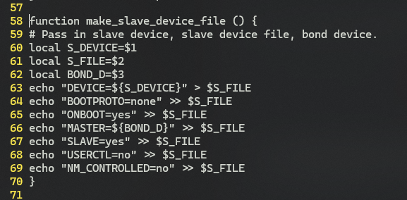
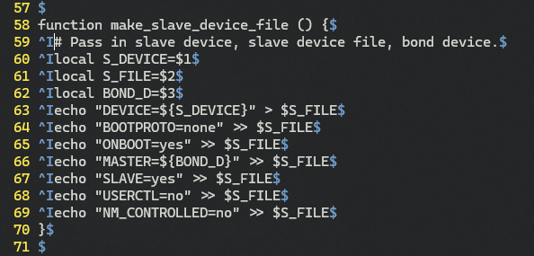
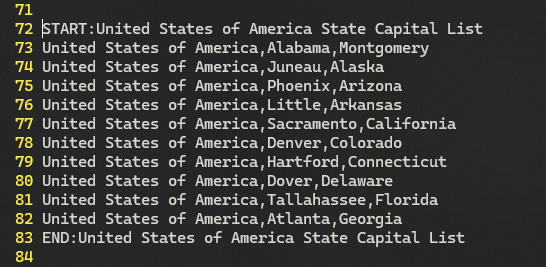
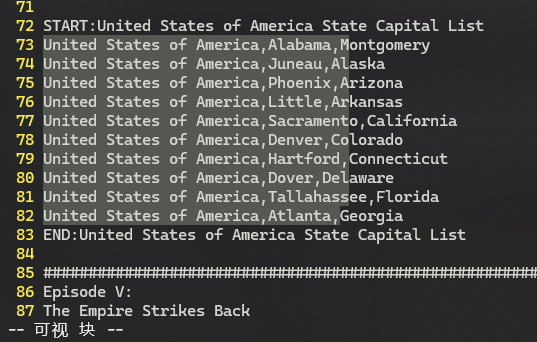
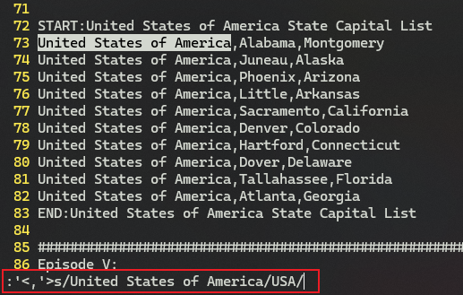
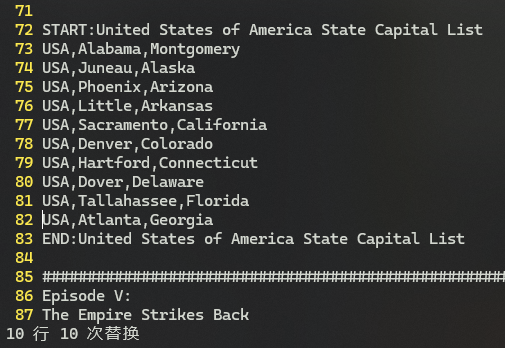
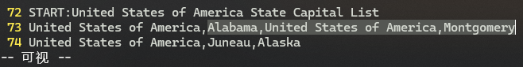
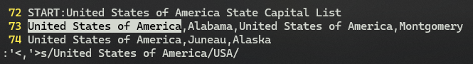
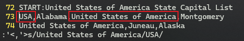
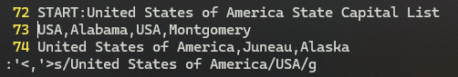

# L35 Visual Mode - Part 2
---

（接上节内容）本节演示文件：`vimclass/visual.txt`。


## 1 利用可视化模式控制代码块的缩进

为下列代码块增加缩进量：



**图 35-1：待添加缩进的示例代码块**

选中目标区域后 ——

- 增加缩进：<kbd>></kbd>
- 减少缩进：<kbd><</kbd>

可视化模式版本：<kbd>Shift</kbd><kbd>V</kbd> + <kbd>I</kbd><kbd>{</kbd> + <kbd>></kbd>

对比正常模式版本：<kbd>></kbd> + <kbd>I</kbd><kbd>{</kbd>

正常模式下，单行内容的缩进控制 ——

- 增加缩进：<kbd>></kbd><kbd>></kbd>
- 减少缩进：<kbd><</kbd><kbd><</kbd>

注意：单行操作时，光标不必定位到行首。


## 2 缩进宽度的设置

通过 <kbd>></kbd> 或 <kbd><</kbd> 控制的缩进量，由命令参数 `shiftwidth` 的大小决定。相关设置命令如下：

```bash
:set shiftwidth?  # 默认为 8 个空格的距离：shiftwidth=8
:set shiftwidth=4 # 改为 4 个空格的距离
```

此外，`Vim` 中的制表符 `\t` 的宽度默认也为 8 个空格，它通过命令参数 `tabstop` 设置：

```bash
:set tabstop?   # 默认为 8 个空格的距离：tabstop=8
:set tabstop=4  # 改为 4 个空格的距离
```

每次增加一个缩进单位，`Vim` 就会插入与 `shiftwidth` 等宽的多个空格；当空格数累计到与 `tabstop` 等宽时，这些连续的空格就会自动替换为 `Tab`，相当于插入了一个 `Tab` 制表符。该默认行为可以通过 `:set list` 命令进行观测：



**图 35-2：打开 list 模式看到的缩进版本（tabstop 和 shiftwidth 均为 8）**

上图中 `^I` 表示一个制表符，`$` 则表示一行的结尾。

由于 `Tab` 与空格混合会令代码缩进效果变差，通常会阻止该默认替换行为。这可以通过手动设置 `:set expandtab` 来实现（默认是关闭状态）。该命令可将 `Tab` 制表符填充为等宽的多个空格。

查看 `Vim` 的 `expandtab` 状态，执行命令 `:set expandtab?` + <kbd>Enter</kbd> 即可。

这些缩进量和缩进行为的设置通常会写入 `vimrc` 文件自动生效。后续会专门介绍 `vimrc` 文件，这里不展开。


## 3 仅对选中区域执行替换操作

给定如下一组文本：



**图 35-3：待处理的示例文本块**

若只对该段文本中的 `United States of America` 批量替换为 `USA`，可以借助区块级可视化模式实现——

1. 选中待替换区域：<kbd>J</kbd> + <kbd>Ctrl</kbd><kbd>Q</kbd> + <kbd>/</kbd><kbd>G</kbd> + <kbd>Enter</kbd>（如图 35-4 所示）
2. 对选中区域使用 `:s/old/new/` 替换命令：键入 <kbd>:</kbd> 后自动补全为 `:'<,'>`。`'<,'>` 就是当前选中区域在命令模式下的写法，分别对应起点和终点，并用逗号分隔。
3. 完整的替换命令为：`:'<,'>s/United States of America/USA/` + <kbd>Enter</kbd>（如图 35-5 所示）



**图 35-4：选中待替换区域后的实测效果图（Windows 版 Vim，v9.1）**



**图 35-5：对选中区块执行替换命令的实测效果图**

这样就实现了仅对选中区域进行文本替换，而其他位置的匹配项则不受影响，如图 35-6 所示：



**图 35-6：仅对选中区域实现内容替换后的实测效果图**


> [!tip]
>
> **关于视频提到的 Bug 的本地验证**
>
> 视频中还提到录制当时 `Vim` 存在的一个 Bug：命令模式下的替换命令会对一整行生效。也就是说，如果启用的是字符级可视化模式，从命令模式下执行的命令将会对那一整行生效。为此，实操过程中特地在本地进行了验证，发现该 Bug **依然存在**。以下是验证过程（时间：2025 年 1 月17 日）：
>
> 假如同一行有两处匹配项：
>
> 
>
> **图 35-7：临时构造的待验证文本，同一行包含两处待替换内容**
>
> 按 <kbd>V</kbd> 开启字符级可视化模式，并只选中后一个匹配项：
>
> 
>
> **图 35-8：字符级可视化模式下，只选中后面那个匹配项**
>
> 然后在命令行模式下执行相同的替换命令，发现 `Vim` 实时匹配的是选中区外的那个关键词：
>
> 
>
> **图 35-9：在命令模式下执行相同的替换命令**
>
> 按 <kbd>Enter</kbd> 执行命令，实际只替换了选中的第一项，选中区域内的关键词反而未被替换：
>
> 
>
> **图 35-10：执行替换后，选区外的关键词被意外替换，而选取内的却保持原样**
>
> 此时若修改命令，追加一个全局替换 `g`，则两个匹配项 **都会被替换**：
>
> 
>
> **图 35-11：改为全局替换后，两个关键词均被替换，与选中区域无关**
>
> 为了排除实时匹配关键词的影响，又尝试关闭 `is` 参数：`:set nois`。再次测试，问题依旧。
>
> **【结论】**
>
> 对于 `Vim` 的 `v9.1` 版 `Windows` 版本，当同一行存在多个待替换关键词时，仍然无法通过选中部分关键词、并通过命令行模式中的 `:s/old/new/` 替换命令，实现指定区域内的关键词替换。`:s/old/new/` 命令将无视选中区域，对该行的关键字实施单个（不带 `g` 标记）或全量（带 `g` 标记）替换。


## 4 
