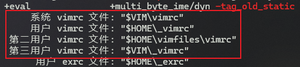
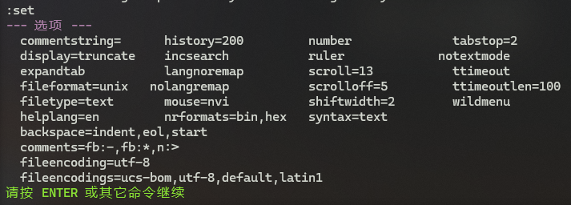
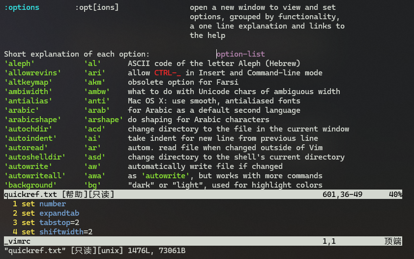
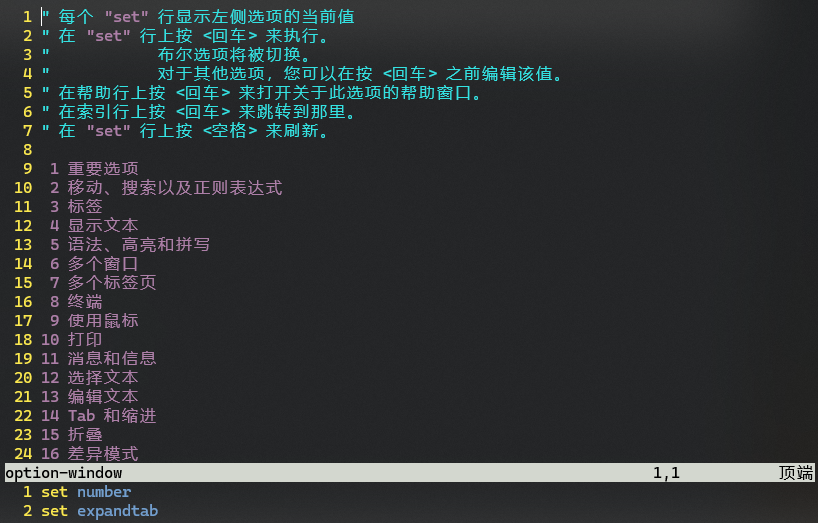

# L38 Vim Settings and the Vimrc File - Part 1
---

本章介绍 `Vim` 的默认配置文件 `vimrc` 的相关操作，本节为第一部分。


## 1 `vimrc` 基本常识

`rc`：全称为 `run commands`。文件名用 `rc` 作后缀是 `Unix` 与 `Linux` 系统的命名风格。`Vim` 启动时会自动执行 `vimrc` 文件中的初始配置。

`vimrc` 文件又分系统层 `vimrc` 文件与用户级 `vimrc` 文件。

> **最佳实践**
>
> 安装 `Vim` 时按默认配置安装（系统层配置），使用时分不同用户做个性化定制（用户级配置）。

`vimrc` 文件的具体位置：

- `Unix` / `Linux`/ `Mac` 系统：`~/.vimrc`（`~` 表示当前用户的 **home directory**，即 **主目录**）
- `Windows` 系统：`$HOME/_vimrc`

此外，也可以通过查看 `Vim` 的版本来查看该文件的具体路径（打开 `Vim` 后输入 `:version` + <kbd>Enter</kbd>）：



**图 38-1：实测 Windows 版 Vim 版本中记录的 vimrc 文件路径情况**

安装 `Vim` 时通常不会自动创建全局 `vimrc` 文件。默认情况下，启动 `Vim` 会查找一个名为 `~/.vimrc` 的用户配置文件，但该文件需要用户 **手动创建**。

此外，该文件也可以在系统管理员创建新用户时生成。

> [!tip]
>
> **补充知识：Linux 创建新用户时生成 `vimrc` 文件的方法（from ChatGPT）**
>
> 在 `Linux` 中创建新用户时，可以通过配置文件自动为该用户生成 `vimrc` 文件。这通常通过设置用户主目录中的默认文件来实现。具体步骤如下：
>
> 1. **使用默认的用户模板**：在许多 `Linux` 发行版中，会有一个用户模板目录（如 `/etc/skel`），其中可以放置新用户的默认配置文件。你可以在这个目录中放置一个 `.vimrc` 文件。
>
> 2. **创建或复制 `.vimrc` 文件**：
>
>    - 将你想要的 `vimrc` 文件（例如，包含基本配置的文件）复制到 `/etc/skel` 目录：
>
>      ```bash
>      cp /path/to/your/vimrc /etc/skel/.vimrc
>      ```
>
> 3.    **创建新用户**：当你通过命令 `useradd` 创建新用户时，如果没有指定 `-k` 参数（用于指定用户模板目录），新用户的主目录会自动复制 `/etc/skel` 中的文件，包括 `.vimrc`。
>
> 4.    **确认新用户的配置**：可以通过登录新用户或查看其家目录来确认 `.vimrc` 文件是否已创建。
>
>
> **示例**
>
> ```bash
> sudo useradd -m newuser
> ```
>
> 在这个例子中，命令将创建一个名为 `newuser` 的新用户，并为其创建一个家目录 `/home/newuser`。如果你省略 `-m`，那么 `newuser` 将没有家目录。

`vimrc` 文件的每一行记录一个 `Vim` 命令，只是命令前不加冒号 `:`。`set ruler` 等效于 `:set ruler` + <kbd>Enter</kbd>。


## 2 关于 `set` 命令

`vimrc` 文件中用得最多的命令就是 `set` 命令。输入 `:set` + <kbd>Enter</kbd> 可以查看当前 `Vim` 设置的所有非默认值的配置项，例如：



**图 38-2：实测当前 Vim 所有非默认值的配置项（Windows 版 v9.1）**

查询某配置项的当前状态、当前取值：`:set <option_name>?` + <kbd>Enter</kbd>

例如 `:set incsearch?`、`:set hls?` 等。


## 3 布尔选项

查询 `hls`（全名 `hlsearch`，高亮查询）的 `Vim` 帮助文档，可以看到该命令选项是一个布尔值（`boolean (default off)`），表示该选项可以设为开启或关闭。

|  配置操作  |     命令     |       查询执行结果        |
| :--------: | :----------: | :-----------------------: |
| 开启 `hls` |  `:set hls`  |        `hlsearch`         |
| 关闭 `hls` | `:set nohls` |       `nohlsearch`        |
| 切换 `hls` | `:set hls!`  | `hlsearch` / `nohlsearch` |
|  查询状态  | `:set hls?`  | `hlsearch` / `nohlsearch` |


## 4 从 `history` 命令考察带选项值的配置项

例如 `history` 选项：

- 查看其帮助文档：`:h 'history'` + <kbd>Enter</kbd>
- 设置历史记录表为 500 行：`:set history=500` + <kbd>Enter</kbd>
- 重置为默认值：`:set history&` + <kbd>Enter</kbd>（这样 `:set` + <kbd>Enter</kbd> 给出的配置清单中将移除 `history` 选项）

> **上下箭头的使用技巧**
>
> 输入 <kbd>:</kbd> 后，也可以用 <kbd>↑</kbd><kbd>↓</kbd> 键快速显示历史命令，并且支持模糊匹配：输入 `:h h` + <kbd>↑</kbd>，可以快速列出最近一次以 `h` 开头的历史命令；再按 <kbd>↑</kbd> 列出倒数第二个以 `h` 开头的历史命令，以此类推。该方法可以大幅缩短候选的历史命令列表。


## 5 `vimrc` 文件的创建

打开 `Vim` 后创建文件的方法：`:e ~/.vimrc` + <kbd>Enter</kbd>

在 <kbd>Ctrl</kbd><kbd>G</kbd> 命令前加一个非零数字，即可展示当前文件的完整路径，例如键入 <kbd>1</kbd><kbd>Ctrl</kbd><kbd>G</kbd> 后，我的状态栏将显示：


**图 38-3：查看当前文件完整路径的方法：非零数字 + Ctrl + G**


## 6 查看所有支持的配置项

输入 `:h option-list` + <kbd>Enter</kbd> 即可：



**图 38-4：查看当前支持的 vimrc 配置选项实测截图**

此外，也可以使用 `:options` + <kbd>Enter</kbd> 快速查看和修改当前选项的状态：



**图 38-5：执行命令 :options 将打开一个选项窗口**


> [!tip]
>
> **关于 `:options` 与 `:h option-list` 的区别**
>
> （from ChatGPT）
>
> 在 `Vim` 中，`:options` 和 `:h option-list` 有不同的用途和显示内容：
>
> **`:options`**
>
> - **功能**：`:options` 命令用于打开一个窗口，显示当前所有可用的选项及其状态（即当前值）。
> - **交互性**：在这个窗口中，你可以查看每个选项的当前设置，并可以通过输入相应的命令来修改这些选项。
> - **用途**：适合快速查看和修改当前选项，尤其对于不熟悉的选项，能够直观地查看它们的状态。
>
> **`:h option-list`**
>
> - **功能**：`:h option-list` 是用于查看 `Vim` 帮助文档中的选项列表。它会显示所有可用的选项及其简要说明，并提供有关如何使用这些选项的信息。
> - **静态信息**：帮助文档提供的是静态信息，不是实时的选项状态。它主要用于学习和参考。
> - **用途**：适合查阅选项的详细说明、默认值、影响等信息。
>
> **总结**
>
> - 使用 `:options` 可以快速查看和修改当前选项的状态。
> - 使用 `:h option-list` 可以查阅选项的文档和详细说明。
>
> 这两者结合使用，可以帮助你更好地理解和配置 `Vim` 的行为。


## 7 `vimrc` 文件常用配置演示

1. `set history=1000`：设置历史命令保留最近 1000 项（重启 `Vim` 后生效）
2. `" Keep 1000 items in the history`：`vimrc` 文件注释信息的写法（以 `"` 开头，不支持多行注释）
3. `set ruler`：在状态栏实时显示当前光标的位置信息
4. `set showcmd`：在右下角实时查看按键内容
5. `set wildmenu`：用 <kbd>Tab</kbd> 键补全命令时，让候选项以菜单形式展示（具体用法详见第四章 L14 课）
6. `set scrolloff=5`：用 <kbd>Z</kbd> + <kbd>Enter</kbd> 将光标所在行重绘到页面顶部时，在当前行上方预留出 5 行
7. `set hlsearch`：开启实时高亮检索（最佳实践：在 `vimrc` 文件使用全称，确保可读性；命令模式下可用简写提高效率）
8. `set incsearch`：开启增量查询
9. `set ignorecase`：检索时忽略大小写
10. `set smartcase`：开启智能大小写检索，通常作为 `set ignorecase` 的增强配置——
    1. 若匹配规则包含大写字母，则检索将区分大小写；
    2. 若匹配规则全为小写字母，则检索将忽略大小写。
11. `set number`：显示行号
12. `set backup`：启用文件备份模式（例如，`.vimrc` 将同步生成一个备份文件：`.vimrc~`）
    1. `set bex=SOMETHING`：手动设置备份文件的后缀为 `SOMETHING`，替换默认的 `~`
13. `set linebreak` 或 `set lbr`：让 `Vim` 在显示较长的行内容时自动换行，而不是在一行的末尾位置自动折行
14. `set ai` 或 `set autoindent`：在插入模式下输入回车换行、或者通过 <kbd>O</kbd> 或 <kbd>Shift</kbd><kbd>O</kbd> 插入一行时，自动沿用当前光标行的缩进量。
15. `set si` 或 `set smartindent`：开启智能缩进模式（先开启 `set ai`）——
    1. 输入 `{` 时表示代码块的开始，下一行会自动缩进；
    2. 输入 `}` 时表示代码块的结束，`Vim` 会自动减少缩进到之前的位置。
16. `set bg=light`：开启明亮模式；
17. `set bg=dark`：开启暗黑模式；


