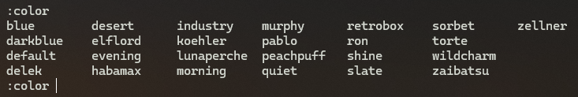
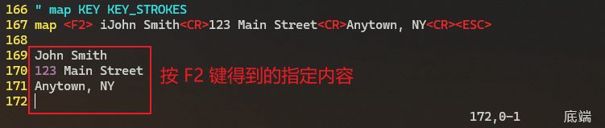
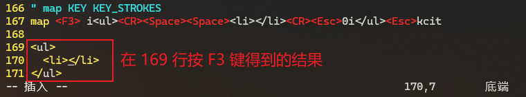
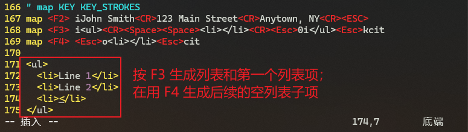
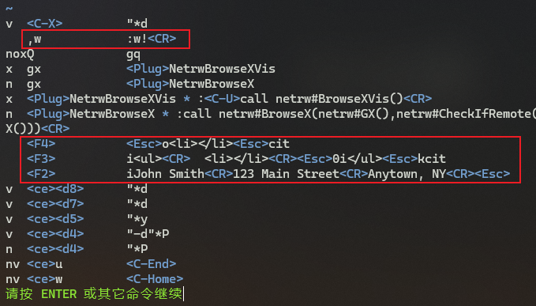
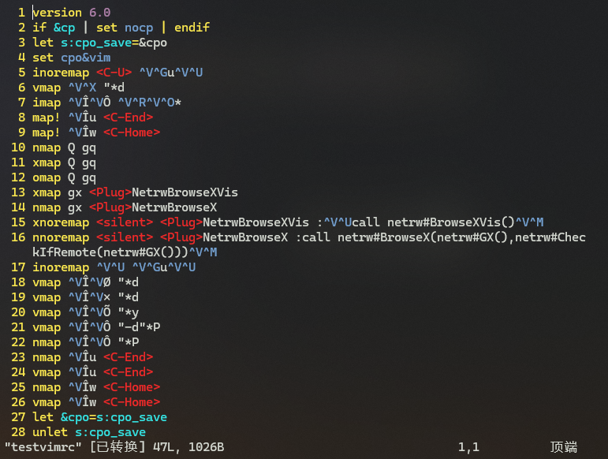
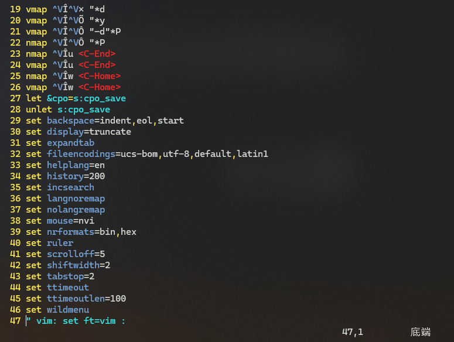

# L39 Vim Settings and the Vimrc File - Part 2
---

（接上节）

## 1 Vim 的配色方案与 color 命令

查看可用的配色方案：`:color` + <kbd>Space</kbd> + <kbd>Ctrl</kbd><kbd>D</kbd>



**图 39-1：查看当前可用的配色方案（Windows 版 v9.1）**

查看当前使用的配色方案：`:colorscheme` + <kbd>Enter</kbd>

在 `vimrc` 文件中指定配色方案（如 `slate`）：`color slate`

从网上下载的第三方配色方案，需放到当前用户主目录对应的 `colors` 文件夹下：

- `Linux`：`/home/{USER_NAME}/.vim/colors`
- `Mac`：`/Users/{USER_NAME}/.vim/colors`


## 2 map 命令

`Vim` 中的 `map` 命令可将一组 `Vim` 命令映射为一个单独的按键，例如将某个功能键定义为一组特定操作（默认情况下功能键未设置任何命令）。

`map` 命令在 `vimrc` 文件中的写法：`map KEY KEY_STROKES`（按 `KEY` 执行 `KEY_STROKES` 中的操作）

例如：

```markdown
map <F2> iJohn Smith<CR>123 Main Street<CR>Anytown, NY<CR><ESC>
```

保存后重启 `Vim`，重新打开 `vimrc` 文件，并在末尾行键入 <kbd>F2</kbd>，将得到如下结果：



**图 39-2：利用 map 命令实现指定内容与 F2 键绑定的实操截图**


`map` 命令中常见按键的写法：

|    写法    |     按键      |       写法       |     按键     |
| :--------: | :-----------: | :--------------: | :----------: |
|   `<BS>`   |  `Backspace`  |    `<Insert>`    |   `Insert`   |
|   `<CR>`   |    `Enter`    |     `<Del>`      |   `Delete`   |
| `<Enter>`  |    `Enter`    |     `<Home>`     |    `Home`    |
| `<Return>` |    `Enter`    |     `<End>`      |    `End`     |
|  `<Esc>`   |   `Escape`    |    `<PageUp>`    |  `Page-Up`   |
| `<Space>`  |    `Space`    |   `<PageDown>`   | `Page-Down`  |
|   `<Up>`   |  `Up arrow`   |     `<Tab>`      |    `Tab`     |
|  `<Down>`  | `Down arrow`  |     `<bar>`      |     `|`      |
|  `<Left>`  | `Left arrow`  |     `<C-X>`      |   `Ctrl-X`   |
| `<Right>`  | `Right arrow` | `<F1>` - `<F12>` | 相应的功能键 |


## 3 示例：用 map 命令快速生成 HTML 代码片段

利用 `map` 命令还可以将输入某 HTML 代码片段的操作映射到某个功能键（例如 <kbd>F3</kbd>）。具体写法如下：

```markdown
map <F3> i<ul><CR><Space><Space><li></li><CR><Esc>0i</ul><Esc>kcit
```

保存配置并重启 `Vim`，并在末尾行键入 <kbd>F3</kbd>，将得到如下结果：



**图 39-3：利用 F3 键快速生成 HTML 模板并进入插入模式实测截图**

此时如果再定义一组按键操作（假设绑定到 <kbd>F4</kbd>），实现在下一行快速插入 `<li></li>`，并将光标定位到标签内部，则可以写作：

```markdown
map <F4> <Esc><li></li><Esc>cit
```

这样就可以组合 <kbd>F3</kbd> 和 <kbd>F4</kbd> 快速完成 HTML 代码段的编辑和插入，如图 39-4 所示：



**图 39-4：利用 F3 和 F4 键快速实现 HTML 代码段的编辑和插入操作**


## 4 Vim 中的 Leader 键

`Vim` 中的 `Leader` 键用于创建自定义快捷键，其默认值为反斜杠符 `\`，也可以用 `let mapleader=","` 改为其它字符（这里改为 `,`）。

正常模式下要让 `\w` 实现强制实时保存的功能（即 `:w!` + <kbd>Enter</kbd>），可以在 `vimrc` 中做如下定义：

```markdown
map <leader>w :w!<CR>
```

配置生效后，按 <kbd>\\</kbd><kbd>W</kbd> 键就能实现强制保存当前文件。

如果不用反斜杠，也可以写为：

```markdown
let mapleader=","
map <leader>w :w!<CR>
```

这样，按 <kbd>,</kbd><kbd>W</kbd> 即可保存。

查看当前 `map` 的设置情况，输入命令 `:map` + <kbd>Enter</kbd> 即可：



**图 39-5：查看当前定义的 map 命令配置情况**

更多 `map` 命令的用法，详见 `Vim` 帮助文档（运行命令 `:h mapping` + <kbd>Enter</kbd>）。


## 5 用 mkvimrc 命令自动生成配置文件

除了手动创建并修改 `vimrc` 文件，还可以使用命令 `:mkvimrc` 来创建 `vimrc` 文件。如果文件已存在，则要么用 `:mkvimrc testvimrc` 指定一个新文件名（如这里的 `testvimrc`），要么用 `:mkvimrc!` 覆盖已存在的文件。

使用这种方式创建的 `vimrc` 文件与手动创建的略有不同，其中既有来自系统层的设置，也有来自 `mkvimrc` 命令本身的内容，例如：



**图 39-6：通过 mkvimrc 命令生成的 vimrc 文件内容（节选）**

其中 ——

- `vmap` 表示仅在可视化模式下生效
- `nmap` 表示仅在正常模式下生效
- `vnoremap`：仅在可视化模式下禁止递归生效快捷键设置
- `nnoremap`：仅在正常模式下禁止递归生效快捷键设置
- `" vim: set ft=vim :`：位于该文件最后一行（如图 39-7 所示），也叫 `modeline`，它用于指示 `Vim` 在处理该文件时要遵循的特定设置。`set ft=vim` 用于指定文件类型（`ft` 即 `filetype`，表示文件类型）为 `vim`。这样 `Vim` 就会启用适合 `Vim` 脚本的语法高亮和功能来显示该文件。末尾的冒号为固定写法，表示命令的结束。更多用法参考帮助文档：`:h modeline` + <kbd>Enter</kbd>。



**图 39-7：利用 mkvimrc 命令生成的 vimrc 文件的末尾部分截图**

值得注意的是，`vimrc` 大可不必如此复杂，只要满足自身需求，简单实用即可。例如讲师 **Jason** 的极简配置：

```markdown
set bg=dark
color slate
set wildmenu
set ruler
```
