# L42 Editing Multiple Files and Vim Buffers
---

本节演示文件：`vimclass/buf-{ant,bed,cat,dad}.txt`、`vimclass/modes.txt`。

## 1 Vim 缓冲区的应用场景

主要涉及以下几类需要频繁切换编辑区的场景——

- 在源代码和头文件之间频繁切换（C 语言环境）；
- 在源码文件和测试代码间频繁切换；
- 主配置文件和分支配置文件之间频繁切换；

以往的解决方案：使用 `tmux` 或 `screen` 这样的终端复用工具（Terminal multiplexer）。

## 2 缓冲区的概念

**缓冲区（buffer）** 是 `Vim` 的一个极其重要的核心概念，同时也是 `Vim` 管理和编辑文本的核心机制。

当用 `Vim` 打开某个文件，`Vim` 就会将该文件的内容读取到内存中。这个正在编辑的文件或文本的内存副本（in-memory representation），就称为 `Vim` 的一个 **缓冲区**（`buffer`）。换言之，缓冲区是加载到内存中的供人们编辑处理的文件。

缓冲区的另一个通用定义来自计算机学科：缓冲区是一个临时的内存区域，可用于数据的存储、处理与传输。

在 `buffer` 中所做的更改都是暂时的。除非明确保存（使用 `:w` 命令），否则变更内容不会影响实际文件。

值得注意的是，尽管缓冲区通常与文件相关联，但也并非必须关联。例如可以不借助任何文件直接打开 `Vim`，此时 `Vim` 会开辟一个空缓冲区（empty buffer）；而当保存内容时，必须指定一个文件路径才能保存成功。

## 3 用 Vim 打开多个文件

主要有两种方法：

1. 逐一打开（与 `Vim` 有关）：正常打开第一个文件后，后续文件逐一使用 `:e <file_path_name>` + <kbd>Enter</kbd> 打开（`e` 的全称即 `edit`，意为编辑、修改）；
2. 批量打开（与 `Vim` 无关）：利用 `Shell` 脚本的展开语法，可使用模糊匹配：`vim buf*`

## 4 查看 Vim 打开的文件列表

使用 `:buffers` + <kbd>Enter</kbd>

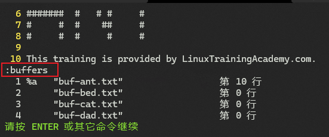

**图 42-1：用 buffers 命令查看 Vim 当前打开的所有文件列表**

截图中的列表信息分四列：

1. 第一列为缓冲区唯一标识；
2. 第二列为相关的指示器和标记（flags）；
3. 第三列为文件名；
4. 第四列为光标在各缓冲区中的位置。

`:buffers` 命令还有两个别名：`:files` 和 `:ls`，都能实现同样的功能。相对而言 `:ls` 更加友好。

## 5 在多个文件间切换浏览

常见的操作如下：

- `:buffer <buffer_id>`：利用缓冲标识进行切换，例如切到第二个文件：`:buffer 2` + <kbd>Enter</kbd>
  - `:buffer 2` 也可以简写为 `:b2`
- `:b <buffer_name>`：`:b` 命令也可以跟文件名（或缓冲区名），例如 `:b buf-dad.txt` + <kbd>Enter</kbd>
- `:b` + <kbd>Space</kbd> + <kbd>Tab</kbd> 补全：列出候选项以供选择（如图 42-2 所示）
- `:b` + <kbd>Space</kbd> + <kbd>Ctrl</kbd><kbd>D</kbd>：类似自动补全，以菜单形式列出备选项（如图 42-3 所示）
- `:bnext`：简写为 `:bn`，用于切换到 **下一个** 缓冲标识对应的文件；
- `:bprevious`：简写为 `:bp`，用于切换到 **上一个** 缓冲标识对应的文件；
- `:bfirst`：简写为 `:bf`，用于切换到 **第一个** 缓冲标识对应的文件；
- `:blast`：简写为 `:bl`，用于切换到 **最后一个** 缓冲标识对应的文件；

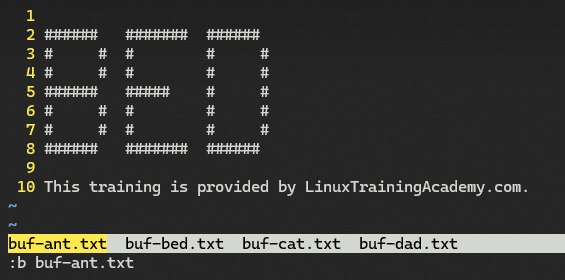

**图 42-2：使用 Tab 调出候选文件列表（先启用 wildmenu 选项）**

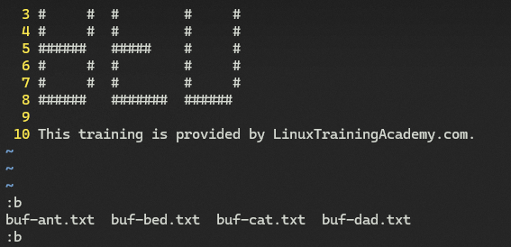

**图 42-3：使用 Ctrl + D 调用的候选文件列表**

## 6 快速切换到上一次打开的文件

使用组合键 <kbd>Ctrl</kbd> + <kbd>^</kbd>：可快速切换到上一次打开的文件。

例如，当前位置在 `buf-dad.txt`，通过 `:b2` 切换到 `buf-bed.txt` 后，可以使用 <kbd>Ctrl</kbd><kbd>^</kbd> 快速切换回 `buf-dad.txt`（实操过程中发现，`Vim` 组合键 <kbd>Ctrl</kbd><kbd>^</kbd> 与 `Windows Terminal` 的快捷键冲突，但可以使用 <kbd>Ctrl</kbd> + <kbd>6</kbd> 实现同样的功能）。

如果从第 2 个 `buf-bed.txt` 切换到第 4 个 `buf-dad.txt`，查看缓冲区列表将看到标记列出现了不同内容，如图 42-4 所示：

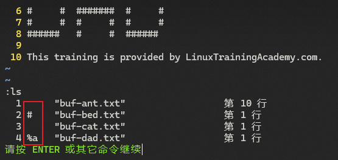

**图 42-4：第二列标记列显示的不同文件状态**

其中，`%a` 表示当前窗口显示的缓冲区（`a` 即 **a**ctive，表示激活状态），`#` 表示上一次编辑的缓冲区，也叫 **备用缓冲区（alternate buffer）**。除了使用组合键 <kbd>Ctrl</kbd><kbd>6</kbd>，备用缓冲区也可以直接通过 `:b#` + <kbd>Enter</kbd> 进行切换。

## 7 关于 Vim 中的隐藏缓冲区

在未保存变更内容的情况下，切换到其他缓冲区将报错：

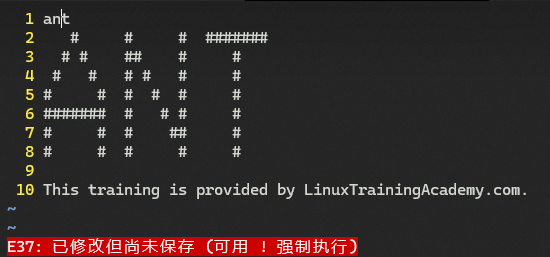

**图 42-5：不保存当前修改直接跳转其他缓冲区，Vim 将提示报错**

此时缓冲区列表也会出现新的变化：

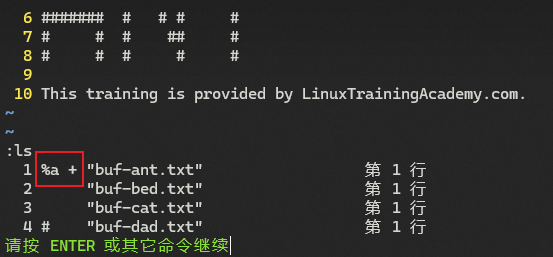

**图 42-6：当文件变更未保存，缓冲列表将以 + 号进行标识**

解决方案：

1. 先用 `:w` 保存，再进行正常切换；
2. 按照提示信息，使用 `!` 强行切换：例如强行切换到下一个文件：`:bn!` + <kbd>Enter</kbd>

若使用第二种方式，未保存的文件会出现新的标记 `#h +`，如图 42-7 所示：

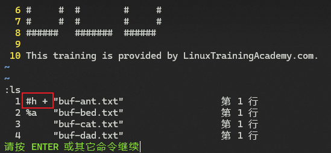

**图 42-7：使用叹号强制切换后，原文件出现的新标记情况截图**

这里的 `h` 表示该文件此时是一个隐藏缓冲区（hidden buffer）。

`Vim` 中的缓冲区可分为三类——

- `active`：标记为 `a`，即加载到内存并显示到当前窗口的缓冲区；
- `hidden`：标记为 `h`，表示虽加载到内存、但并未显示到当前窗口的缓冲区；
- `inactive`：没有标记，表示既没有加载到内存，也没有显示到当前窗口的缓冲区。

因此，对于未激活的缓冲区，`Vim` 默认将释放加载它们时的内存资源，但仍会保留它们的元数据信息（例如光标所在的行位置、基于该缓冲区的特定配置等）。如果不希望切走后释放内存，可以运行命令 `:set hidden` + <kbd>Enter</kbd> 将其变为隐藏缓冲区。例如，

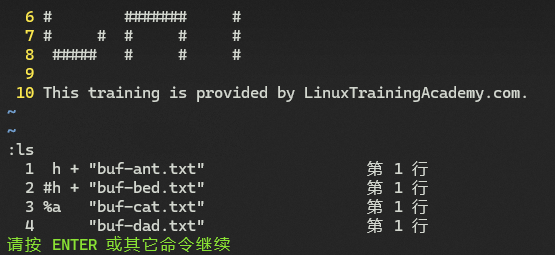

**图 42-8：启用 hidden 开关后，未修改的切换不再提示报错信息，同时未激活的文件 buf-ant.txt 也会变为隐藏缓冲区**

正因为启用了 `hidden` 选项，后续打开过又切走的文件都将变为 `hidden` 状态。

但如果此时强行退出（`:q!`）`Vim` 则会重新提示报错信息：

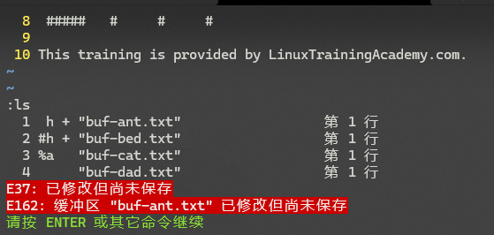

**图 42-9：强行退出所有文件，Vim 会重新提示报错信息**

此时若再次使用 `:q!` 将丢弃所有变更内容，直接退出所有文件；也可以分别使用 `:w` 保存后再逐一退出。

`hidden` 选项也可以写入 `vimrc` 文件永久生效。

打开多个缓冲区后，批量不保存退出，可以使用命令 `:qall!` + <kbd>Enter</kbd>；批量保存文件变更，则可以使用 `:wall` + <kbd>Enter</kbd>。

## 8 缓冲区的增删操作

在介绍 `vimrc` 文件时，利用 `mkvimrc!` 命令会覆盖当前可能正在编辑的 `.vimrc` 文件，但窗口还是替换前的版本。想要刷新当前文件内容，需运行命令 `:e` + <kbd>Enter</kbd>。

若要在打开 `Vim` 时引入新的缓冲区，需使用 `:badd <file_name>` + <kbd>Enter</kbd> 实现，但窗口不会立即切换到新文件，只是更新了缓冲区列表。例如添加 `modes.txt` 后查看 `:ls`：

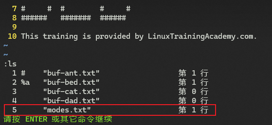

**图 42-10：通过 badd 命令新增的 modes.txt 文件状态截图（当前窗口为 buf-bed.txt）**

若要移除某缓冲区，可以切换到该文件，然后运行 `:bd` + <kbd>Enter</kbd>；也可以用 `:bd <buffer_id>`、`:bd <file_name>`。例如删除 `buf-cat.txt`，需运行 `:bd 3` + <kbd>Enter</kbd>。

此外，`:bd` 命令还可以指定具体范围，格式为：`:[range]bd` + <kbd>Enter</kbd>。例如删除前三个缓冲区，需执行命令：`:1,3bd` + <kbd>Enter</kbd>：

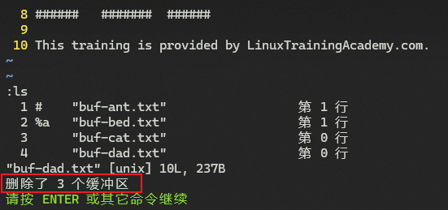

**图 42-11：指定范围删除前三个缓冲区后的状态栏提示情况截图（Windows 版 v9.1）**

同理，也可以使用 `:%bd` + <kbd>Enter</kbd> 删除所有缓冲区（`%` 对应所有范围，详见 S06L23 课）。此时再用 `:ls` 查看缓冲区列表，将得到一个未命名缓冲区，与不带任何文件直接打开 `Vim` 的情况类似：

**图 42-12：删除所有缓冲区后看到的缓冲区列表情况截图**

## 9 为多个文件批量显示行号

使用命令 `:bufdo set nu` + <kbd>Enter</kbd>

## 10 实现多个文件内容的批量替换

例如，要将打开的所有文件中的 `#` 符号批量替换为 `@`，如果直接运行 `:bufdo %s/#/@/g` + <kbd>Enter</kbd> 将报错——每个文件替换后未能保存修改（`hidden` 选项默认为关闭状态）：

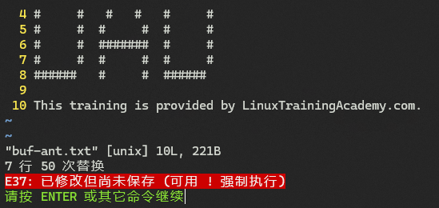

**图 42-13：用 bufdo 命令直接跨多个文件批量替换文件内容将报错**

解决方案：使用管道符号 `|` 作命令分隔符，实现一边替换一边保存，写作：`:bufdo %s/#/@/g | w` + <kbd>Enter</kbd>：

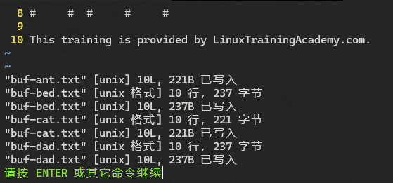

**图 42-14：利用管道符号实现“边替换、边保存”的跨文件批量替换功能**

除了使用管道符，还可以启用 `hidden` 选项，这样每个文件都可以不用保存变更内容，缓冲列表也会相应变化：

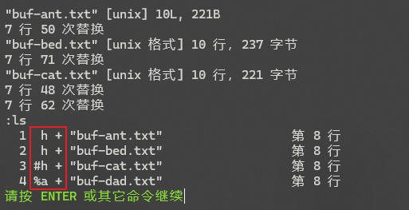

**图 42-15：开启 hidden 选项后，不用管道符串联多个命令也可以批量替换，不过文件状态有所不同**

此时可以使用 `:wall` + <kbd>Enter</kbd> 保存所有变更。

## 11 Vim 内置的资源管理器用法

输入命令 `:E` + <kbd>Enter</kbd> 可以在 `Vim` 中打开一个资源管理器窗口：

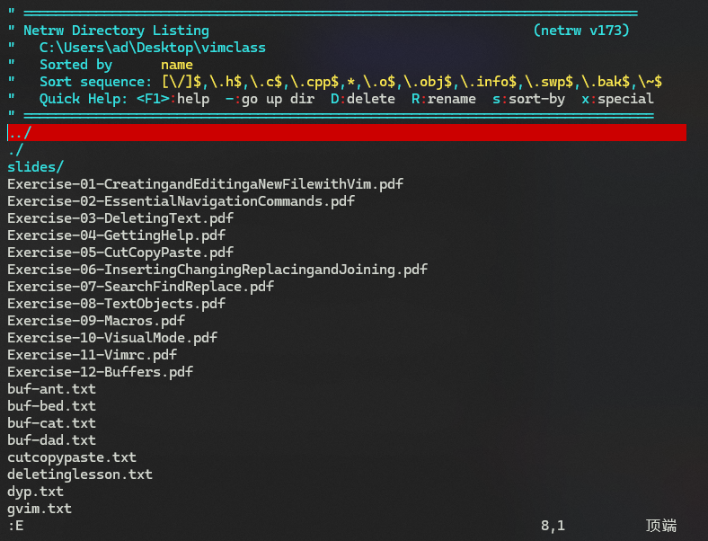

**图 42-16：使用 E 命令打开的 Vim 资源管理器临时窗口截图**

该窗口也是一个缓冲区，因此若要退出该窗口返回到之前的窗口，使用 `:bd` + <kbd>Enter</kbd> 即可（运行 `:E` 命令再次进入）。资源管理器窗口是 `Vim` 内置插件 `NetRW` 提供的一个增强功能，支持普通的按键浏览、文本检索等功能。可以根据顶部提示进行操作。

要打开某个文件，只需让光标定位到该文件，按回车键 <kbd>Enter</kbd> 即可。这种方式打开的文件与通过 `:badd <file_name>` 打开的效果一样。

## 12 本课小结

- `:e` / `:edit` 逐一打开多个文件
- `Shell` 扩展语法批量打开多个文件
- `:buffers` / `:ls` 查看缓冲区列表信息
- `:b <buffer_id>` / `:b <file_name>`：定位到具体文件
- `:bnext` / `:bn`：切到下一个缓冲区
- `:bprevious` / `:bp`：切到上一个缓冲区
- `:bfirst` / `:bf`：切到第一个缓冲区
- `:blast` / `:bl`：切到最后一个缓冲区
- `:badd`：新增缓冲区
- `:bdelete` / `:bd`：删除缓冲区
- `:bufdo`：对每个缓冲区批量执行操作命令
- `:set hidden`：隐藏缓冲区相关知识点

