# L45 Working with Multiple Windows
---

本节演示文件：`vimclass/buf-{ant,bed,cat,dad}.txt`、`vimclass/nav.txt`。

## 1 水平分割窗口

默认情况下，`Vim` 一个窗口只会加载一个编辑界面。即便在学习 `Vim` 缓冲区的概念时，也只涉及单一窗口下的各类操作；多窗口环境只在第四章介绍帮助系统时提到过，并可通过 <kbd>Ctrl</kbd> + <kbd>W</kbd><kbd>W</kbd> 让光标在两个窗口间切换、用 `:q` + <kbd>Enter</kbd> 命令关闭某个窗口，仅此而已。

其实，`Vim` 还支持通过 `:sp` 或 `:split` 命令实现窗口的 **水平分割**。

例如，用 `vim buf*` 批量打开多个以 `buf` 开头的演示文件后，输入 `:sp` + <kbd>Enter</kbd> 将得到两个上下分布的相同窗口：

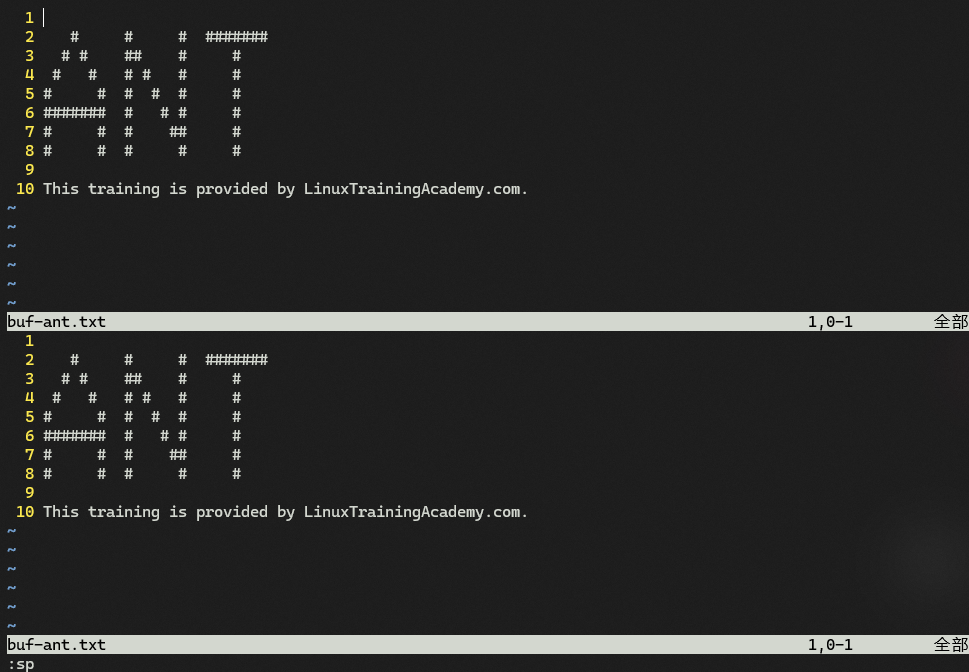

**图 45-1：用 sp 命令实现窗口的水平分割**

由于显示的是同一个缓冲区，在其中任一窗口修改内容都会同步影响到另一个窗口。

`:sp` 命令还可以等效替换为 <kbd>Ctrl</kbd><kbd>W</kbd> + <kbd>S</kbd>（即按住 <kbd>Ctrl</kbd> 的同时敲 <kbd>W</kbd> 键、然后放开 <kbd>Ctrl</kbd> 后再敲 <kbd>S</kbd> 键）

## 2 在水平分割的新窗口中显示其它文件内容

执行命令 `:sp <file_name>` + <kbd>Enter</kbd> 即可。

例如，让新开窗口加载 `buf-bed.txt` 中的内容，需输入：`:sp buf-bed.txt` + <kbd>Enter</kbd>：

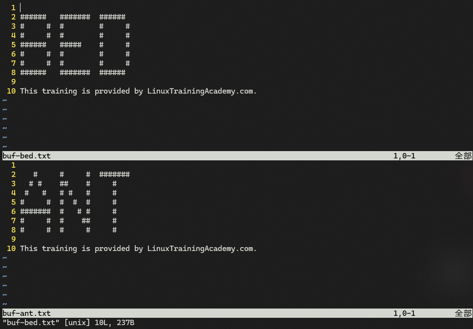

**图 45-2：在水平分割窗口时在新窗口显示指定的文件内容（buf-bed.txt）**

## 3 垂直分割窗口

使用 `:vs` + <kbd>Enter</kbd> 或 `:vsplit` + <kbd>Enter</kbd>。

同理，也可以使用组合键 <kbd>Ctrl</kbd><kbd>W</kbd> + <kbd>V</kbd> 作等效替换：

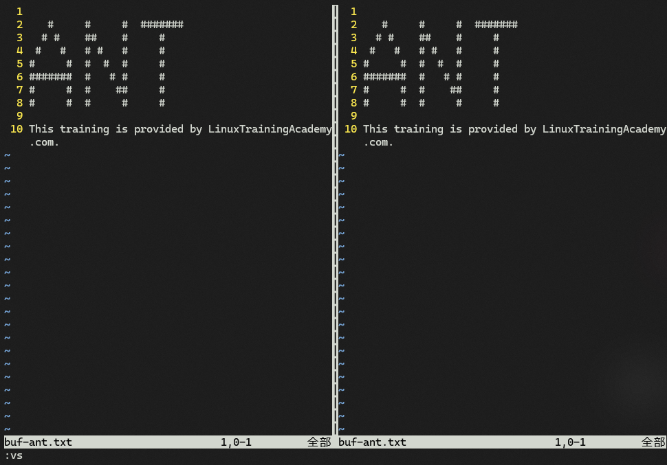

**图 45-3：使用 vs 命令实现窗口的垂直分割**

同理，执行命令 `:vs <file_name>` + <kbd>Enter</kbd> 可指定新窗口加载的文件内容。

## 4 窗口的关闭

使用命令 `:q` + <kbd>Enter</kbd> 或者组合键 <kbd>Ctrl</kbd><kbd>W</kbd> + <kbd>Q</kbd>。

## 5 在同一窗口水平拆分出多个窗口

多次执行 `:sp <file_name>` 命令即可：

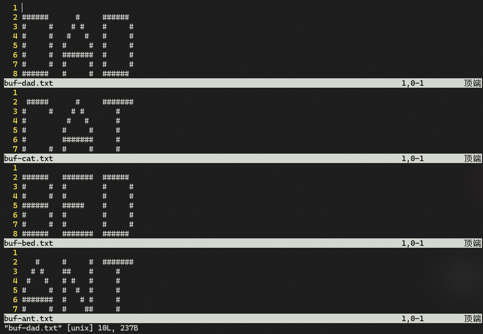

**图 45-4：利用 “sp + 文件名” 的方式依次水平打开不同的文件内容**

## 6 关闭其余窗口

两种方式：

1. 输入 `:on` + <kbd>Enter</kbd> 或 `:only` + <kbd>Enter</kbd>；
2. 使用组合键 <kbd>Ctrl</kbd><kbd>W</kbd> + <kbd>O</kbd>

## 7 让四个文件呈田字形排列

即纵横分割窗口，先后使用水平、垂直分割（无关顺序）：

1. 先加载 `buf-dad.txt` 文件，然后执行水平分割：`:sp buf-bed.txt` + <kbd>Enter</kbd>；
2. 再输入 `:vs buf-ant.txt` + <kbd>Enter</kbd> 垂直分割上半部分窗口；
3. 按两次【<kbd>Ctrl</kbd><kbd>W</kbd> + <kbd>W</kbd>】将光标切到下方窗口（即 `buf-dad.txt`）；
4. 输入 `:vs buf-cat.txt` 完成下半部分的垂直分割。

最终实测效果：

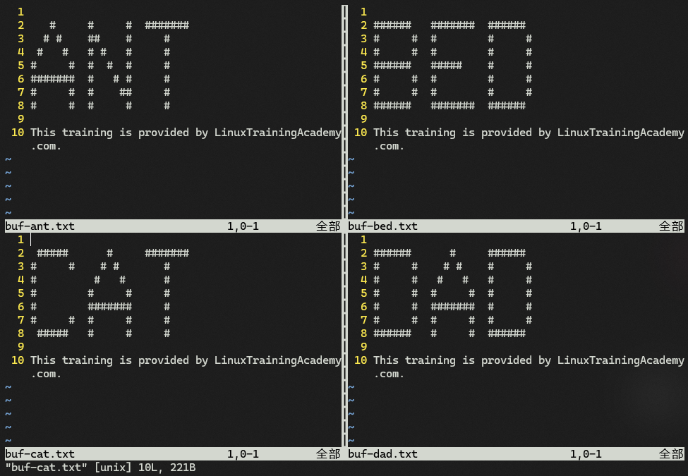

**图 45-5：用水平垂直分割实现四个文件呈田字形分布实测效果截图**

## 8 光标在多窗口中的定位

除了用 <kbd>Ctrl</kbd><kbd>W</kbd> + <kbd>W</kbd> 逐一切换光标位置，还可以使用导航键实现上下左右移动：

- <kbd>Ctrl</kbd><kbd>W</kbd> + <kbd>H</kbd>：光标左移；
- <kbd>Ctrl</kbd><kbd>W</kbd> + <kbd>J</kbd>：光标下移；
- <kbd>Ctrl</kbd><kbd>W</kbd> + <kbd>K</kbd>：光标上移；
- <kbd>Ctrl</kbd><kbd>W</kbd> + <kbd>L</kbd>：光标右移；

注意到涉及窗口操作的组合键都有相同的前缀 <kbd>Ctrl</kbd><kbd>W</kbd>。为方便后续操作，也可以使用 `map` 命令重新指定快捷键并写入 `vimrc` 配置文件：

- `map <C-h> <C-w>h`
- `map <C-j> <C-w>j`
- `map <C-k> <C-w>k`
- `map <C-l> <C-w>l`

或者利用 `Leader` 键重写快捷键：

- `map <leader>h <C-w>h`
- `map <leader>j <C-w>j`
- `map <leader>k <C-w>k`
- `map <leader>l <C-w>l`

如果是在图形界面下操作，还可以直接用鼠标单击快速定位。

## 9 调节子窗口的尺寸大小

两种方式：

- 图形界面：鼠标拖拽窗口边缘即可调整；
- 键盘操作：
  - 增加高度：<kbd>Ctrl</kbd><kbd>W</kbd> + <kbd>+</kbd>
  - 减少高度：<kbd>Ctrl</kbd><kbd>W</kbd> + <kbd>-</kbd>
  - 增加宽度：<kbd>Ctrl</kbd><kbd>W</kbd> + <kbd>></kbd>
  - 减少宽度：<kbd>Ctrl</kbd><kbd>W</kbd> + <kbd><</kbd>
  - 高度最大化：<kbd>Ctrl</kbd><kbd>W</kbd> + <kbd>_</kbd>
  - 宽度最大化：<kbd>Ctrl</kbd><kbd>W</kbd> + <kbd>\|</kbd>
  - 设置等宽等高：<kbd>Ctrl</kbd><kbd>W</kbd> + <kbd>=</kbd>

## 10 变换子窗口的位置

使用 <kbd>Ctrl</kbd><kbd>W</kbd> + <kbd>R</kbd> 可将当前水平排列的窗口依次 **往右** 挪动一格，最右边的窗口则挪到 **最左边** 位置；若子窗口均为垂直堆叠分布，则依次 **往下** 挪动一格，同时最下方窗口挪到 **最上方** 位置。

使用 <kbd>Ctrl</kbd><kbd>W</kbd> + <kbd>Shift</kbd><kbd>R</kbd> 则刚好反向操作：水平排列的子窗口 **向左** 移动、垂直堆叠的则 **向上** 移动。

注意：组合键中的 <kbd>R</kbd> 代表 **R**ight，向右；<kbd>Shift</kbd><kbd>R</kbd> 则表示反向。

## 11 将光标所在的子窗口分别靠进某一边

通过组合键 <kbd>Ctrl</kbd><kbd>W</kbd> + **大写的导航键**，还可以分别令光标所在的子窗口分别靠近大窗口的上、下、左、右侧。

例如，在刚才的田字形排列的多窗口界面，再使用 `:vs nav.txt` 垂直分割出第五个子窗口：

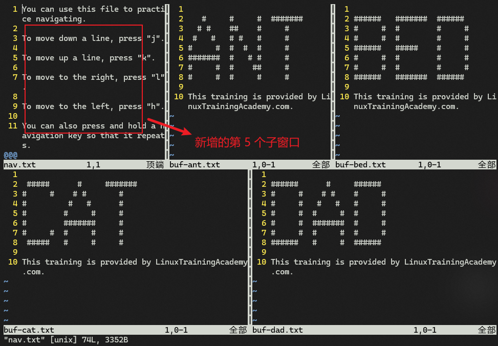

**图 45-6：在田字形多窗口界面引入第五个子窗口（左上角）**

按 <kbd>Ctrl</kbd><kbd>W</kbd> + <kbd>Shift</kbd><kbd>H</kbd> 实现靠左显示：

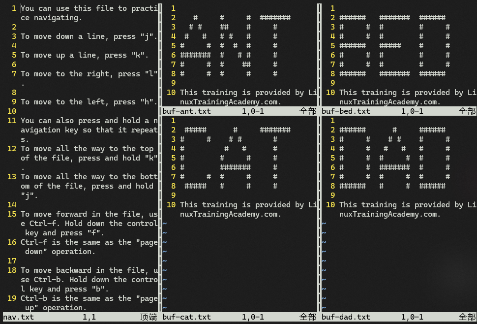

**图 45-7：让子窗口（nav.txt）靠左显示后的效果图**

按 <kbd>Ctrl</kbd><kbd>W</kbd> + <kbd>Shift</kbd><kbd>L</kbd> 实现靠右显示：

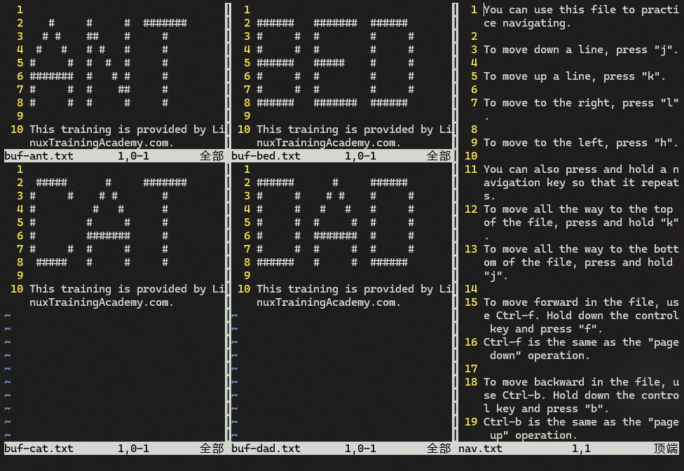

**图 45-8：让子窗口（nav.txt）靠右显示后的效果图**

按 <kbd>Ctrl</kbd><kbd>W</kbd> + <kbd>Shift</kbd><kbd>K</kbd> 实现靠上显示：

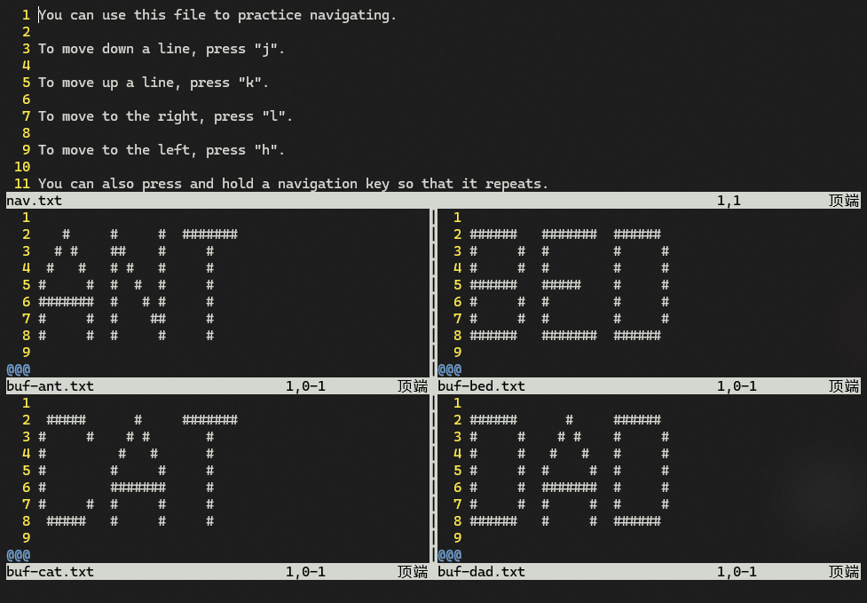

**图 45-9：让子窗口（nav.txt）靠上显示后的效果图**

按 <kbd>Ctrl</kbd><kbd>W</kbd> + <kbd>Shift</kbd><kbd>J</kbd> 实现靠下显示：

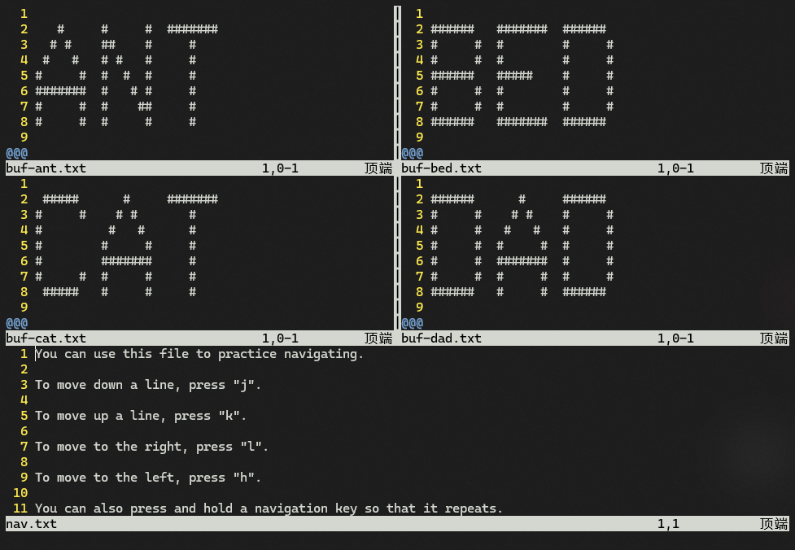

**图 45-10：让子窗口（nav.txt）靠下显示后的效果图**

## 12 将所有缓冲区加载到当前窗口

使用命令 `:ball` + <kbd>Enter</kbd> 或 `:ba` + <kbd>Enter</kbd>。

此时 `Vim` 默认通过水平分割的方式加载每个子窗口：

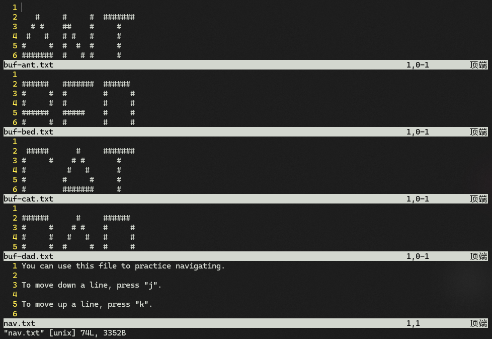

**图 45-11：使用 ba 命令一次性加载所有缓冲区的实测效果图**

## 13 对所有子窗口批量执行命令

与缓冲区的 `:bufdo` 命令类似，多窗口也支持批量执行命令 `:windo`。

例如，在垂直排列的子窗口 `buf-ant.txt` 和 `buf-bed.txt` 中，批量执行替换命令，将文件中的 `#` 全部替换为 `@`，则相应的批量替换命令为：`:windo %s/#/@/g` + <kbd>Enter</kbd>。

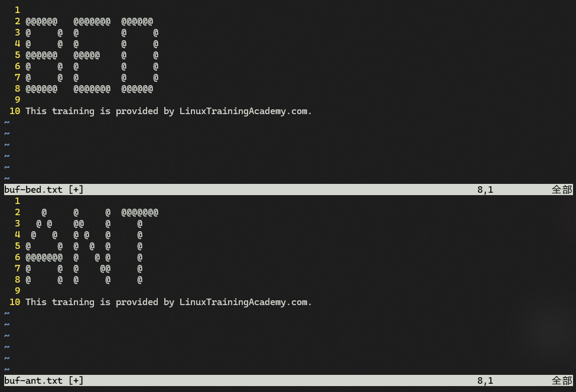

**图 45-12：对所有子窗口批量执行替换命令后的效果图**

> [!note]
>
> **注意**
>
> 值得注意的是，`:windo` 命令只对打开的子窗口生效，未打开的子窗口则不受影响 ；而 `:bufdo` 命令则会对所有缓冲区生效，无论它是不是隐藏缓冲区都会执行命令。本例可以通过 `:ls` + <kbd>Enter</kbd> 命令加以佐证：
>
> 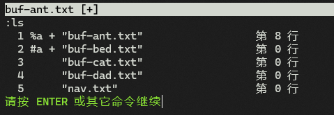
>
> **图 45-13：用 ls 命令查看缓冲区列表，可以看到本例中的批量替换命令 windo 只对打开的子窗口生效**

## 14 关于窗口组合键的按键细节

本课涉及大量组合键，对于 <kbd>Ctrl</kbd><kbd>W</kbd> + `<KEY>` 的操作，既可以放开 <kbd>Ctrl</kbd> 键后再按后面的 `<KEY>` 键，也可以一直按住 <kbd>Ctrl</kbd> 键不放、并依次按 <kbd>W</kbd> 键和 `<KEY>` 键。

查看帮助文档 `:h ctrl-w` + <kbd>Enter</kbd> 可以获得更多操作说明：

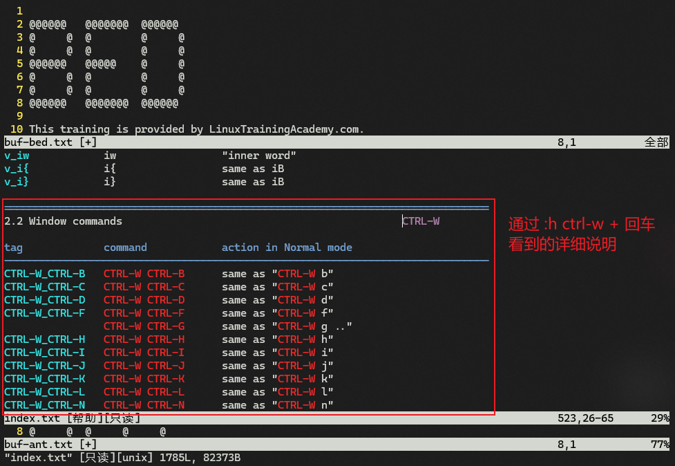

**图 45-14：查看 ctrl-w 帮助文档了解组合键的更多细节说明**

需要注意的是，按住 <kbd>Ctrl</kbd> + <kbd>S</kbd> 在某些命令行中可能会引发冲突（例如暂停屏幕刷新），此时使用 <kbd>Ctrl</kbd> + <kbd>W</kbd><kbd>S</kbd> 来水平拆分窗口就会失效；同理，<kbd>Ctrl</kbd> + <kbd>W</kbd><kbd>Q</kbd> 也可能因为 <kbd>Ctrl</kbd><kbd>Q</kbd> 被占用而导致窗口拆分失败。不过具体问题具体分析，遇到组合键冲突，最好通过帮助文档寻求解决方案。

想了解更多关于 `Vim` 窗口的用法细节，可以查看 `Vim` 内置的帮助文档：`:h windows` + <kbd>Enter</kbd>。

