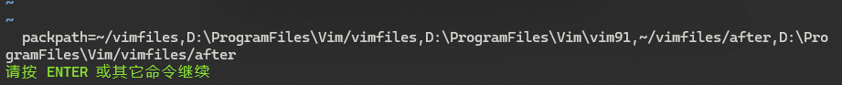
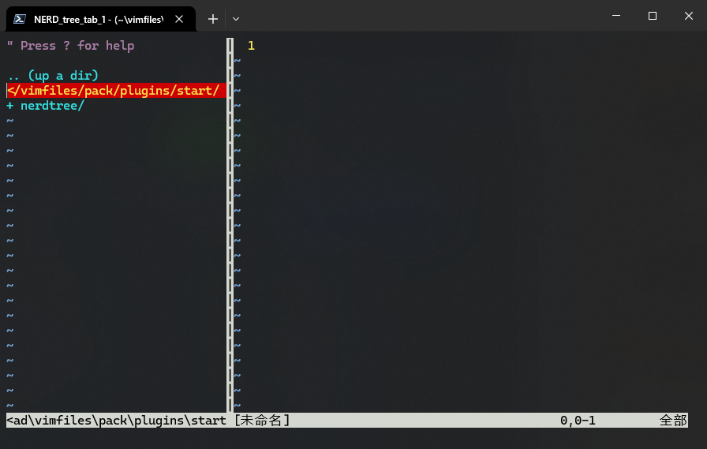
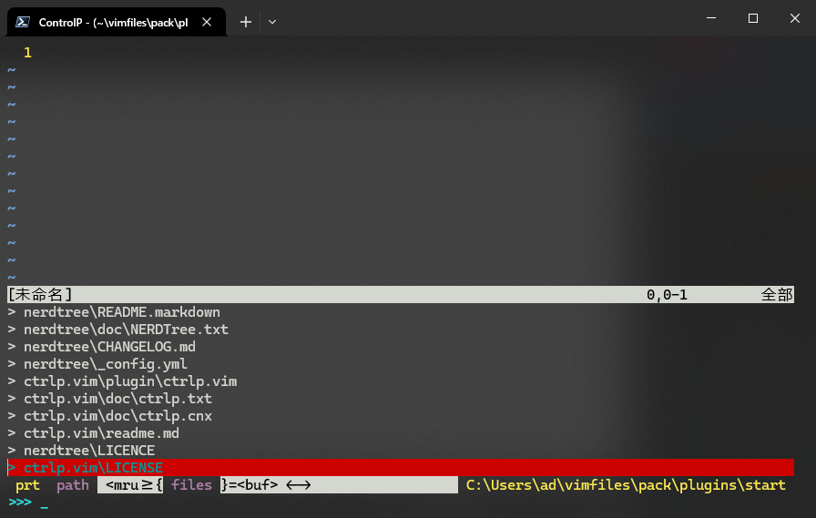
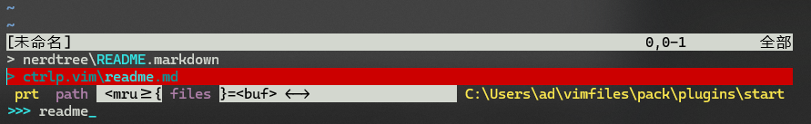
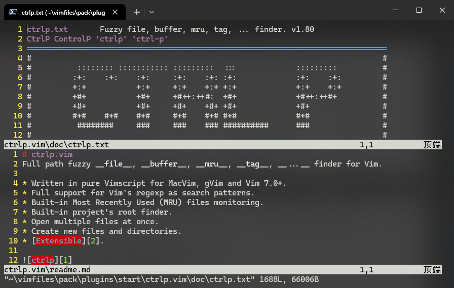
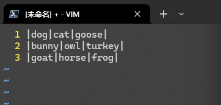
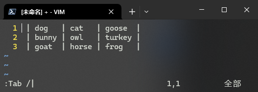
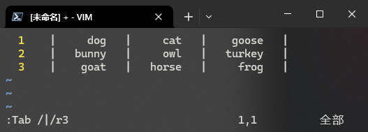

# L46 Managing Vim Plugins
---


## 1 第三方插件管理工具

如果 `Vim` 版本早于 `V7.x`，安装 `Vim` 插件需要借助以下第三方插件管理工具：

- `vim-plug`
- `Vundle`
- `NeoBundle`
- `Pathogen`

而从 `V8.0` 以后，`Vim` 就自带插件管理工具。

本节仅介绍 `V8.0` 及以上版本的插件管理。


## 2 安装插件使用的搜索引擎

主要有两个：

- **谷歌** 网站：`https://www.google.com/`
- **VimAwesome** 网站：`https://vimawesome.com/`


## 3 Vim 插件的安装方法

由于绝大部分 `Vim` 插件的源码都托管到了 `GitHub` 平台，通过 `Git` 来安装 `Vim` 第三方插件就成了最简便的安装方式。因此需要先安装 `Git`。

不同平台安装 `Git` 的方法 ——

- `RedHat`：`def install git`
- `Debian`：`apt install git`
- `Windows`：`https://git-scm.com/`

然后使用命令 `:set packpath` + <kbd>Enter</kbd> 查看插件存放的路径：



**图 46-1：查看 Vim 默认存放插件的路径（Windows 版 v9.1）**


## 4 存放 `Vim` 插件包的路径格式

通用格式为：`{packpath}/pack/{package-name}`

这里的 `package` 包指代一个或多个插件。多个功能类似或具有协同作用的插件也可以用一个 `package` 包进行统一管理，例如 `~\vimfiles\pack\git-plugins` 这个包（名称自拟）就可以用于存放多个与 `Git` 相关的 `Vim` 插件。

在同一个 `package` 包下，还可以分出 `start` 和 `opt` 两个子文件夹，格式分别为：

- `{packpath}/pack/{package-name}/start/{plugin-name}`
- `{packpath}/pack/{package-name}/opt/{plugin-name}`

例如：

1. `/home/jason/.vim/pack/vendor/start/nerdtree`
2. `/home/jason/.vim/pack/vendor/opt/ctrlp`
3. `/home/jason/.vim/pack/myplugins/start/nerdtree`

二者的区别在于，`start` 中的插件会自动加载；而 `opt` 则需要手动加载。

手动加载命令格式：`:packadd {plugin-directory-name}`

例如，执行命令 `:packadd vim-fugitive` + <kbd>Enter</kbd> 后，`Vim` 会在 `packpath` 对应的路径中按照匹配规则 `pack/*/opt/vim-fugitive` 进行搜索。这样就实现了对插件 `~/.vim/pack/git-plugins/opt/vim-fugitive` 的加载。

注意：`package` 包名对 `Vim` 而言并不那么重要，重要的是插件对应的 **路径名**。


## 5 示例一：插件 NERDTree 的安装

`NERDTree` 是一款让用户在 `Vim` 中高效浏览和管理文件及目录的第三方 `Vim` 插件，`GitHub` 仓库详见：`https://github.com/preservim/nerdtree`。

下面演示 `NERDTree` 的安装步骤（假设要求自动加载）：

```powershell
# 1. 创建相关文件夹
> pwd

Path
----
C:\Users\ad\vimfiles
> mkdir -p pack/plugins/start | Out-Null
> cd pack/plugins/start
> pwd

Path
----
C:\Users\ad\vimfiles\pack\plugins\start

# 2. 复制 NERDTree 仓库
> git clone https://github.com/preservim/nerdtree.git
Cloning into 'nerdtree'...
remote: Enumerating objects: 6269, done.
remote: Counting objects: 100% (94/94), done.
remote: Compressing objects: 100% (56/56), done.
remote: Total 6269 (delta 76), reused 38 (delta 38), pack-reused 6175 (from 4)
Receiving objects: 100% (6269/6269), 2.01 MiB | 697.00 KiB/s, done.
Resolving deltas: 100% (2847/2847), done.
> 
```

然后输入 `vim` + <kbd>Enter</kbd> 打开 `Vim`，并输入 `:NERDTree` + <kbd>Enter</kbd> 打开该插件：



**图 46-2：以自动加载的方式测试安装并启动插件 NERDTree 看到的初始界面**

根据截图，左侧的目录树可用导航键上下移动光标，按 <kbd>O</kbd> 可以展开文件夹（<kbd>Shift</kbd><kbd>O</kbd> 展开所有子文件夹、<kbd>Shift</kbd><kbd>X</kbd> 合拢所有文件夹），按 <kbd>Enter</kbd> 键打开光标所在文件。

使用命令 `:NERDTree F:\your\target\path\` 还可以直接打开指定路径，轻松实现文件基本操作。

更多用法可按 <kbd>?</kbd> 或查阅插件文档（不过多展开）。


## 6 示例二：插件 ctrlp.vim 的安装

`ctrlp.vim` 是另一个功能强大的第三方插件，允许用户通过简洁直观的界面快速搜索和打开文件、缓冲区等内容。

假设还是自动加载，安装过程如下：

```powershell
# 1. 确认当前路径在 start 文件夹下
> pwd

Path
----
C:\Users\ad\vimfiles\pack\plugins\start
# 2. 复制 ctrlp.vim 的 GitHub 代码库
> git clone https://github.com/ctrlpvim/ctrlp.vim.git
Cloning into 'ctrlp.vim'...
remote: Enumerating objects: 4316, done.
remote: Counting objects: 100% (185/185), done.
remote: Compressing objects: 100% (113/113), done.
remote: Total 4316 (delta 78), reused 166 (delta 71), pack-reused 4131 (from 1)
Receiving objects: 100% (4316/4316), 1.71 MiB | 323.00 KiB/s, done.
Resolving deltas: 100% (1668/1668), done.
> ls -n
ctrlp.vim
nerdtree
# 打开 Vim 进行测试
> vim 
```

打开 `Vim` 后，按 <kbd>Ctrl</kbd> + <kbd>P</kbd> 将进入该插件界面：



**图 46-3：打开 Vim 后按【Ctrl + P】看到的插件主界面**

此时可以检索任意关键字定位目标文件。例如，输入 `readme` 得到：



**图 46-4：输入 readme 后，插件快速筛选出包含 readme 的文件**

此时按 <kbd>Enter</kbd> 键即可打开 `ctrl.vim\readme.md` 文件。

再按 <kbd>Ctrl</kbd> + <kbd>P</kbd>，输入 `tx` + <kbd>Ctrl</kbd><kbd>X</kbd>，可以水平分割窗口，并同时打开匹配关键词 `tx` 的第一个文件（即 `ctrl.vim\doc\ctrlp.txt`，如图 46-5 所示）：



**图 46-5：利用 ctrlp.vim 插件可轻松实现文件检索和多窗口展示**


## 7 示例三：插件 tabular 的安装

前面两个插件都是自动加载生效的，再来看一个需要手动加载的插件安装操作。示例插件 `tabular`（`https://github.com/godlygeek/tabular`）可以根据指定的分隔符格式化文本，实现文本和代码的快速对齐。

按手动加载进行安装，具体过程如下：

```powershell
# 1. 检查当前所在路径
> pwd

Path
----
C:\Users\ad\vimfiles\pack\plugins\start
# 2. 创建并进入 opt 文件夹，要求与 start 文件夹同级
> mkdir ../opt | Out-Null
> cd ../opt
> pwd

Path
----
C:\Users\ad\vimfiles\pack\plugins\opt
# 3. 复制 tabular 对应的 GitHub 仓库
> git clone https://github.com/godlygeek/tabular.git
Cloning into 'tabular'...
remote: Enumerating objects: 179, done.
remote: Counting objects: 100% (18/18), done.
remote: Compressing objects: 100% (16/16), done.
remote: Total 179 (delta 8), reused 5 (delta 2), pack-reused 161 (from 1)
Receiving objects: 100% (179/179), 60.33 KiB | 41.00 KiB/s, done.
Resolving deltas: 100% (63/63), done.
> ls -n
tabular
# 4. 打开 Vim 进行测试验证
> vim
```

此时打开 `Vim` 后，直接运行 `:Tab` + <kbd>Enter</kbd> 并不会打开该插件，`Vim` 会报错。需要手动执行加载命令 `:packadd tabular` + <kbd>Enter</kbd>（或使用简写形式 `:pa tabular` + <kbd>Enter</kbd>）。

然后在 `Vim` 中加入一些测试内容：



**图 46-6：演示 tabular 插件功能前的示例文本内容**

将光标移至文件开头位置，执行命令 `:Tab /|` + <kbd>Enter</kbd>，测试内容将自动对齐：



**图 46-7：利用 tabular 插件快速实现文本对齐**

此外，`tabular` 还支持更多配置选项，例如右对齐每列内容，并要求单词到制表符保持三个空格的距离，输入 `:Tab /|/r3` + <kbd>Enter</kbd> 即可：



**图 46-8：利用 tabular 实现更精细的对齐效果示意图**


