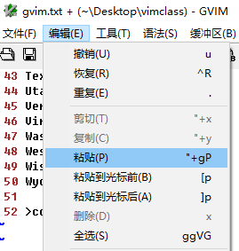

# L47 Vim Graphical User Interfaces: Gvim and MacVim
---

本节演示文件：`vimclass/gvim.txt`。

## 1 图形界面 Vim 的应用场景

绝大部分 `Vim` 命令行操作在其图形界面（GUI）环境下仍然有效，GUI 版的典型的场景包括：

- **同步操作习惯的需要**：希望将远程服务器中 `Vim` 的操作习惯同步迁移到其他桌面环境中（如桌面版 `Linux`、`Mac`、`Windows` 等系统）；
- **保持一致的图形化工作流**：如果工作流主要集中在图形环境而非命令行环境，使用 GUI 版 `Vim` 会更加高效；
- **需要 GUI 特定的功能**：如系统剪贴板、文件资源管理器、鼠标滚轮操作等。

## 2 GUI 版 Vim 的启动

- `Windows`：开始菜单搜 `gVim`、桌面快捷方式、运行窗口输入 `gvim` + <kbd>Enter</kbd>
- `Mac`：搜 `MacVim`
- `Unix` / `Linux`：菜单栏启动、命令行输入 `gvim` + <kbd>Enter</kbd>

安装好命令行版 `Vim` 后通常也会安装 GUI 版 `Vim`，但也有例外。如果 `gVim` / `MacVim` 启动失败，则需要手动安装：

- 到 `Vim` 官网安装：`https://www.vim.org/`；
- `Linux` 用户：也可以通过包管理工具安装，例如 `vim-X11`、`vim-gnome` 等。

## 3 gVim 与 Vim 的主要区别

- `gVim` 有图形化的菜单、工具栏，而 `Vim` 没有；
- 各菜单项的底层也是执行对应的 `Vim` 命令

**图:47-1：gVim 最大的不同在于拥有菜单和工具栏，但底层也是执行对应的 Vim 命令**

平心而论，纯菜单的操作效率并不高，尤其是知晓 `Vim` 等效命令的前提下（对比：重复执行 100 次的菜单操作和命令行操作，高下立判）。这也是为何将 `gVim` 放到最后介绍的原因。

`:set hls!` 对应的菜单位置：

**图 47-2：切换高亮搜索 hls 的菜单位置（Windows 版 gVim）**

再如，`:set scrolloff=5` 对应的菜单位置：

**图 47-3：设置 scrolloff 行数的菜单位置（极其繁琐）**

此外，`gVim` 还支持鼠标滚轮操作，也可以拖动右侧滚动条。

## 4 gVim 中的特殊寄存器

### 4.1. 加号寄存器

`"+`：剪贴板寄存器，负责存放从图形操作系统拷贝来的内容（即选中文字后按 <kbd>Ctrl</kbd> + <kbd>C</kbd>）

要将该内容粘贴到 `gVim` 中，需执行命令 `"+P` 或 `"+p`。这与菜单栏中的命令有所不同：

**图 47-4：将图形界面复制的文本粘贴到 gVim，菜单栏提供的命令与手动执行的命令有所不同**

可以看到，`"+gP` 相较于 `"+P` 多了一个 `g` 命令，它可以让光标自动定位到粘贴内容末尾的下一个字符（如果有余裕的话）；而 `"+P` 只会让光标定位到粘贴内容的最后一个字符：

**图 47-5：对比命令 "+gP 和 "+P 的区别：前者不会定位到目标内容的最后一个字符**

### 4.2. 星号寄存器

`"*` 在不同的操作系统有不同的行为特征：

- `Mac` / `Windows`：星号寄存器 `"*` 与加号寄存器 `"+` 相同，二者可互换；
- `Linux`：`"*` 可以存放 **鼠标选中的文字内容**

另外，不仅其他 GUI 应用可以复制内容到 `gVim`，反向操作也同样支持（对于 `Windows` 系统，使用星号和加号寄存器都是等效的）。 

## 5 Vim 剪贴板的相关设置

在 `Vim` 中，设置 `:set clipboard=unnamed` 后，Vim 会使用系统的剪贴板来处理所有的剪切（delete）、复制（yank）、更改（change）和粘贴（put）操作。这意味着从其他应用程序中复制的文本内容可以直接在 `Vim` 中粘贴，反之亦然。

对 `clipboard` 选项设置 `unnamed` 后，每次复制粘贴都无需再指定特殊寄存器（`"+` 或 `"*`），只需直接使用常规的复制（`y`）和粘贴（`p`）命令即可。

而对于 `Linux` 系统，则需要运行 `:set clipboard=unnamedplus` + <kbd>Enter</kbd> 来实现同样的效果。

> [!tip]
>
> **补充说明**
>
> `:set clipboard=unnamed` 对于 `gVim` 始终有效，但对于 `Vim` 是否生效，取决于当前 `Vim` 的编译版本是否支持剪贴板，只有支持剪贴板的 `Vim` 才会生效。
>
> 这可以通过命令 `:echo has('clipboard')` + <kbd>Enter</kbd> 进行检测：
>
> - 返回结果为 `1`，则表示该版本支持剪贴板；
> - 若返回 `0`，则表示不支持。
>
> 此外也可以通过查看 `:version` 版本中是否包含 `+clipboard` 字样进行判定，有则表示支持。

## 6 gVim 的配置文件

配置文件的文件名：

- `Windows`：`_gvimrc`
- `Linux` / `Mac`：`.gvimrc`

具体路径可在 `gVim` 版本信息中查看：

**图 47-6：在 gVim 的版本信息中查看 gvimrc 文件的具体存放路径**

> [!note]
>
> **注意**
>
> `gvimrc` 文件的加载顺序位于 `Vim` 配置文件 **之后**，这样可以设置特定于 GUI 图形界面的配置项。

## 7 gVim 显示字体的设置

使用命令 `:set guifont=*` + <kbd>Enter</kbd> 或 `:set gfn=*` + <kbd>Enter</kbd>

此时会弹出字体窗口：

**图 47-7：用 gfn 选项设置 gVim 的显示字体样式**

该命令对应的菜单位置如下：

**图 47-8：gVim 设置显示字体样式对应的菜单项位置**

此外，也可以直接手动设置字体及字号，例如：`:set gfn=Courier\ New:h14` + <kbd>Enter</kbd>

注意：上述写法中字体名称不能使用引号，因此中间的空格字符必须 **用反斜杠转义**。

更多 `gVim` 字体设置方法，可以参考 `Vim` 的帮助文档：`:set gui` + <kbd>Enter</kbd>。

> **DIY 拓展**
>
> 实测时发现，除了用 `hXX` 设置字号外，指定字体 `Cascadia Mono PL`、字号为 `13` 后，输入命令 `:set gfn?` + <kbd>Enter</kbd> 查看 `gfn` 最终取值为 `guifont=Cascadia_Mono_PL:h13:cANSI:qDRAFT`：
>
> 
>
> **图 47-9：实测 gVim 字体设置看到的其他配置项**
>
> 根据文档，这里的`:cANSI` 是指定字符级为 `ANSI`；`:qDRAFT` 则表示字体的质量设置为 `DRAFT`：
>
> 
>
> **图 47-10：gfn 帮助文档对 cXX 和 qXX 的官方说明**
